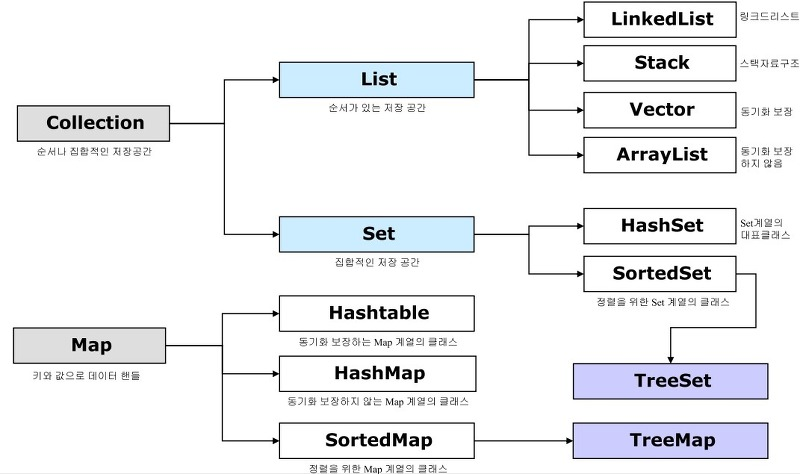
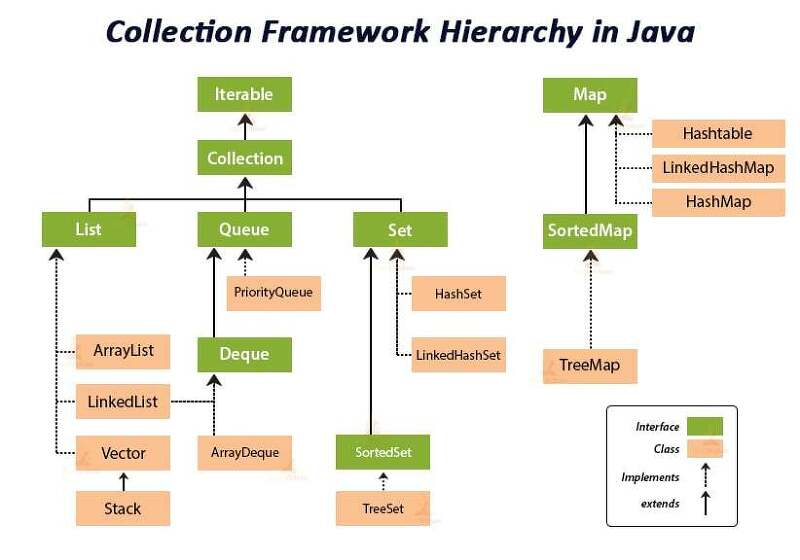

## 컬렉션 프레임워크

자료구조를 바탕으로 객체들을 효울적으로 추가, 삭제, 검색할 수있도록 관련된 인터페이스와 클래스들을 java.util 패키지에 포함시켜놓았다.
이들을 총칭해서 컬렉션 프레임워크라고 한다.

몇가지 인터페이스를 통해서 다양한 컬렉션 클래스를 이용할 수 있도록 설계되어 있다.
 주요 인터페이스로는 List, Set, Map이 있는데 이 인터페이스로 사용가능한 컬렉션 객체 종류는 다음과 같다.
  

  
List와 Set은 객체를 추가, 삭제, 검색하는 방법에 있어서 공통점이 있기 때문에 공통된 메서드만 따로 모아 Collection 인터페이스를 정의해두고 이것을 상속하고 있다.
Map은 키와 값을 하나의 쌍으로 묶어서 관리하느 구조로 되어있어 List, Set과는 사용방법이 다르다. 다음은 각 인터페이스별로 사용할 수 있는 컬렉션의 특징을 정리한 것이다.
<table>
<tr> <td>인터페이스 분류</td> <td>특징</td> <td>구현클래스</td> </tr>
<tr> <td>Collection - List</td> <td> - 순서 유지하고 저장   - 중복 저장 가능 </td> <td>ArrayList, Vector, LinkedList</td> </tr>
<tr> <td>Collection - Set</td> <td>- 순서를 유지하지 않고 저장   - 중복 저장 안됨</td> <td>HashSet, TreeSet</td> </tr>
<tr> <td>Map</td> <td>- 키와 값으로 구성된 엔트리 저장  - 키는 중복 저장 안됨</td> <td> HashMap, Hashtable, TreeMap, Properties </td> </tr>
</table>
