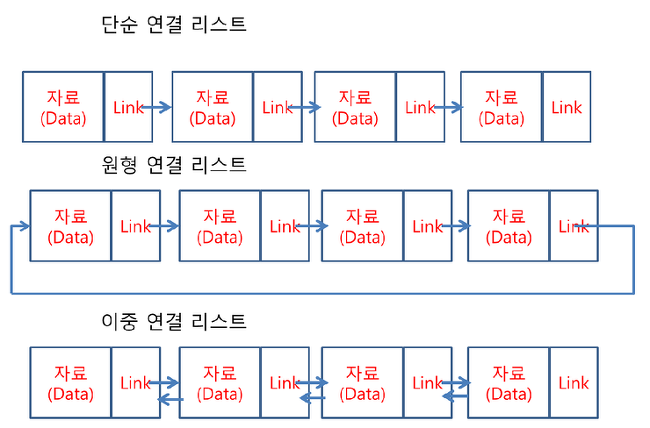
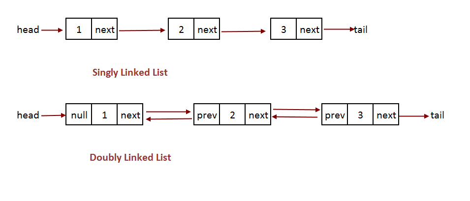

## Linked List
ArrayList와 사용방법은 동일하지만 내부 구조는 완전히 다르다.  ArrayList는 내부 배열에 객체를 저장하지만 , Linked List 는 인접객체를 체인처럼 연결해서 관리한다.
따라서 특정 위치에서 객체를 삽입하거나 삭제하면 바로 앞뒤 링크만 변경하면 되므로 빈번한 객체 삭제와 삽입에서는 ArrayList 보다 좋은 성능을 발휘한다.
<br><br>

<br>

<br><br>

```java
import java.util.LinkedList;

List<E> list = new LinkedList<E>();   //E에 지정된 타입의 객체만 저장
List<E> list = new LinkedList<>();    //E에 지정된 타입의 객체만 저장
List list = new LinkedList();         //모든 타입의 객체를 저장
 
```

