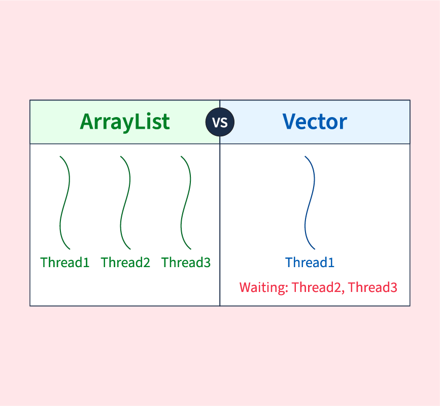

## Vector
ArrayList와 동일한 내부구조를 가지고 있고 차이점은 Synchronized(동기화)된 메소드로 구성되어 있기 때문에 멀티 스레드가 동시에 Vector()메서드를 실행할 수 없다는 것이다.
그렇기 때문에 멀티 스레드 환경에서는 안전하게 객체를 추가, 삭제 할 수 있다.
<br><br>

<br><br>

```java
import java.util.Vector;

List<E> list = new Vector<E>();   // E에 지정된 타입의 객체만 저장
List<E> list = new Vector<>();    // E에 지정된 타입의 객체만 저장
List list = new Vector();         // 모든 타입의 객체 저장
```

ArrayList 와 Vector 의 차이점은 스레들를 실행할때 나타난다.
ArrayList는 VectorExample 클래스를 보면 두 스레드가 동시에 add() 메소드를 호출할 수 있기 때문에 경합이 발생해 결국은 하나만 저장되기 때문이다.
반면 Vector의 add()는 동기화 메소드이므로 한번에 하나의 스레드만 실행할 수 있어 경합이 발생하지 않는다.
따라서 Vector 는 총 갯수 2000개,  ArrayList는 PC에 따라 에러가 발생하거나 2000개가 나오지 않는다.

