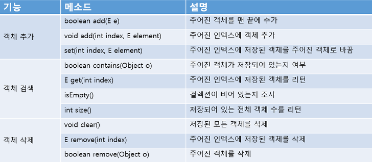
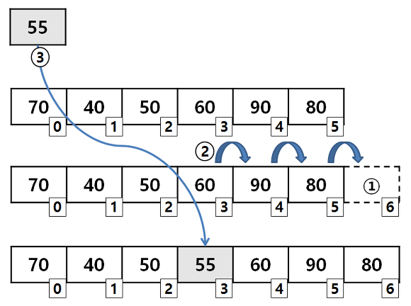

## List 컬렉션
객체를 인덱스로 관리하기 때문에 객체를 저장하면 인덱스가 부여되고 인덱스로 객체를 검색, 삭제할 수 있는 기능을 제공한다.
List 컬렉션에는 ArrayList, Vector, LinkedList 등이 있는데 List 컬렉션에서 공통적으로 사용 가능한 List인터페이스 메소드는 다음과 같다. 
인덱스로 객체들이 관리되기 때문에 인덱스를 매개값으로 갖는 메소드들이 많다.
<br>

<br>
### ArrayList 
List 컬렉션에서 가장 많이 사용하는 컬렉션이다. ArrayList에 객체를 추가하면 내부 배열에 객체가 저장된다. 
**일반 배열과의 차이점은 ArrayList는 제한없이 객체를 추가할 쑤 있다는 것이다.**
List는 객체 자체를 저장하는 것이 아니라 객체의 번지를 저장한다. 동일한 객체를 중복저장할 수 있는데 이 경우에는 동잃란 번지가 저장된다. 
null 또한 저장이 가능하다. 아래ㅔ 그림과 같이 삽입과 삭제가 일어나기 때문에 빈번한 객체의 삭제와 삽입이 일어나는 곳에는 ArrayList를 사용하는 것은 바람직 하지 않다.
대신 그 경우에는 LinkedList를 사용하는 것이 좋다.
<br><br>

<br>
ArrayList컬렉션에 객체를 추가하면 인덱스 0번부터 차례대로 저장된다. 특정 인덱스의 객체를 추가하려면 그 객체의 뒤에 오는 객체는 뒤로 한칸씩 밀린다.
따라서 빈번한 객체의 삽입과 삭제는 Linked List가 좋다.
ArrayList 컬렉션은 다음과 같이 생성할 수 있다.
```java
List<E> list = new ArrayList<E>(); // E에 지정된 타입의 객체만 저장
List<E> list = new ArrayList<>(); // E에 지정된 타입의 객체만 저장, List에 지정한 객체 타입과 동일하다면 쓸 수 있는 방법
List list = new ArrayList(); // 모든 타입의 객체 저장 
```
