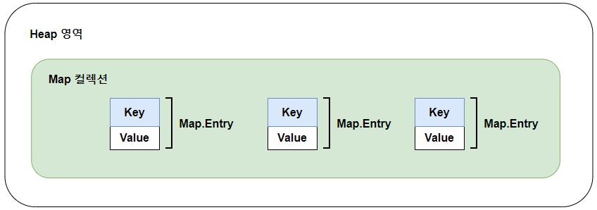
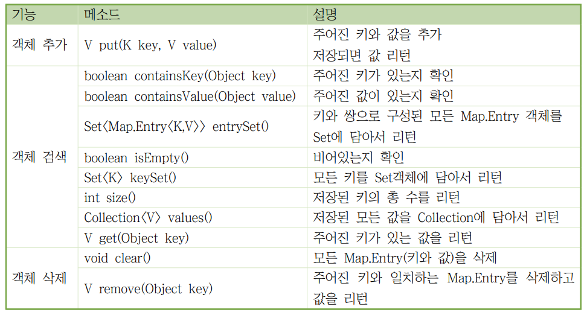
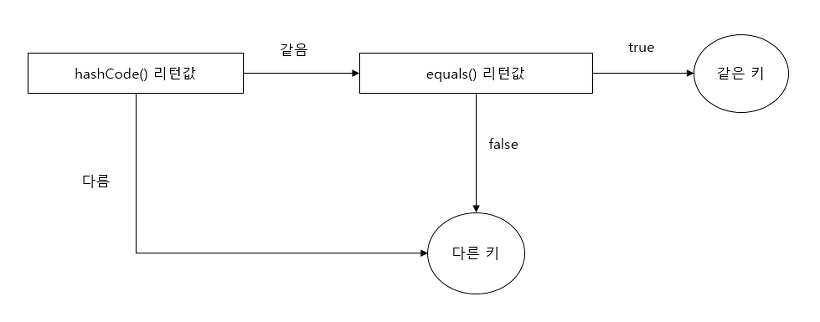
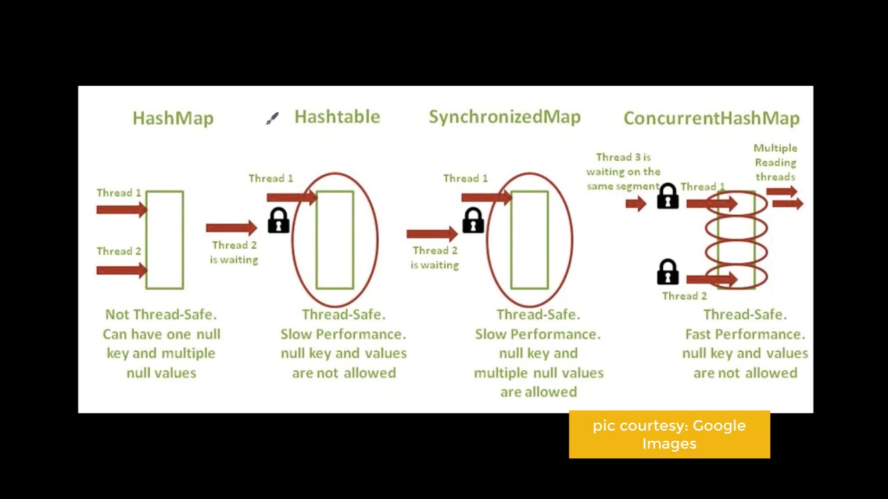
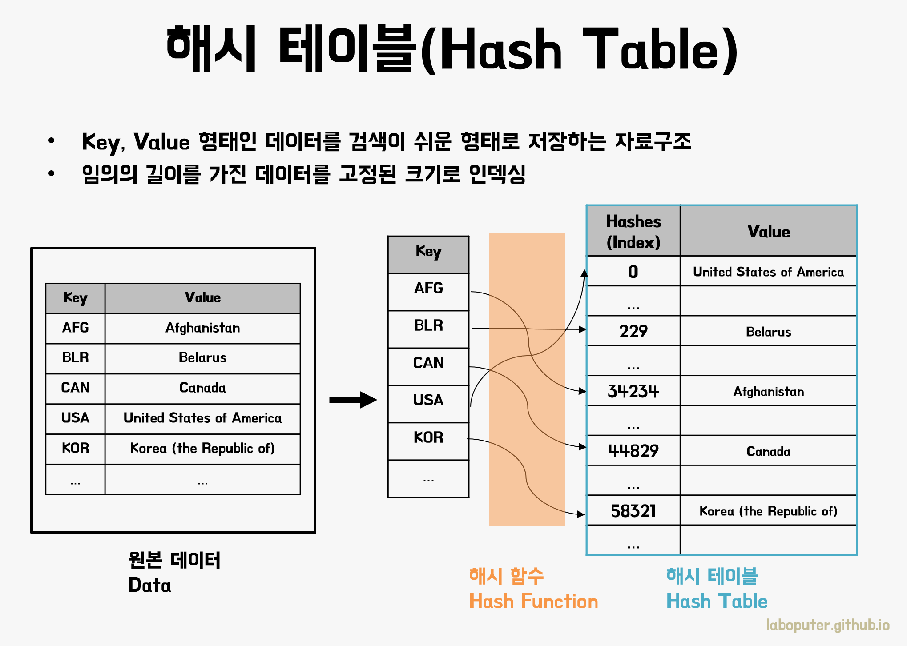
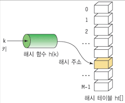

# Map Collection
Key 와 Value 로 구성된 Entry 객체를 저장한다. 여기서 키와 값은 모두 객체이다. 키는 중복 저장할 수 없지만 값은 중복 저장할 수 있다. 기존에 저장된 키와 동일한 키로 값을 저장하면 기존의 값은 없어지교 새로운 값으로 대치된다.
<br><br>

<br><br>
Map 컬레션에는 HashMap, Hashtable, LinkedHashMap, Properties, TreeMap 등이 있다.
Map 컬렉션에서 공통적으로 사용가능한 Map 인터페이스 메소드는 다음과 같다. 키로 객체들을 관리하기 때문에 키를 매개값으로 갖는 메소드가 많다.
<br><br>

<br><br>
K, V 타입 파라미터가 있는데 K는 키타입, V는 값타입을 말한다.

## HashMap
키로 사용할 객체가 hashCode() 메소드의 리턴값과 같고 equals() 메소드가 true를 리턴할 경우. 동일 키로 보고 중복 저장을 허용하지 않는다.
<br><br>

<br><br>
다음은 HashMap 컬렉션을 생성하는 방법이다. K와  V는 각각 키와  값의 타입을 지정할 수 있는 타입 파라미터이다.

```java
import java.util.HashMap;

Map<String, Integer> map = new HashMap<String, Integer>();
Map<String, Integer> map = new HashMap<>();
```
Map에 지정된 키와 값의 타입이  HashMap과 동일할 경우 HashMap<>을 사용할 수 있다.

```java
Map map = new HashMap();
```


## HashTable

HasMap과 동일한 내부구조를 가지고 있다. 차이점은 Hashtable 은 동기화된(synchronize) 메소드로 구성되어 있기 때문에 멀티 스레드가 동시에 Hashtable의 메소드들을 실행할 수 없다는 것이다.
땨라서 멀티 스레드 환경에서도 안전하게 객체를 추가, 삭제할 수 있다.


- HashTable은 thread-safe하다.
- 다음은 키타입으로 String 을 값 타입으로 Integer를 갖는 Hashtable을 셍성한다.

```Java
import java.util.Hashtable;

Map<String, Integer> map = new Hashtable<String, Integer>();
Map<String, Integer> map = new Hashtable<>();
```
모든 타입의 키와 객체를 저장할 수 있는 HashTable은 생성할 수 있지만 그런 경우는 잘 없다.
```java
Map map = new HashTable();
```



<br>
HashMap으로 실행하면 두 스레드가 동시에 put() 메소드를 호출할 수 있기 때문에 경합이 발생하고 결국은 하나만 저장되고 
반면 HashTable의 put()은 동기화 메소드이므로 한번에 하나의 스레드만 실행할 수 있어 경합이 발생하지 않는다. 이는 Thread-safe하다.


# Properties
Hashtable의 자식 클래스이기 때문에 HashTable의 특징을 그대로 가지고 있다.
키와 값을 String 타입으로 제한한 컬렉션이다.
Properties는 주로 확장자가 .properties 인 프로퍼티 파일을 읽을 떄 사용한다.
프로퍼티 파일은 다음과 같이 키와 값이 = 기호로 연결되어 있는 텍스트 파일이다. 일반 텍스트 파일과는 다르게 ISO 8859-1문자셋으로 저장되며
한글읠 경우에는 \u+유니코드로 표현되어 저장된다.

```database
# database.properies 파일
driver=oracle.jdbc.OracleDriver
url=jdbc:oracle:thin:@lpcalhost:15521:orcl
username=scott
password=cat
admin=\uD64D\uAE38\uB3D9
```
Properties을 사용하면 위와 같은 프로퍼티 파일의 내용을 코드에서 쉽게 읽을 수 있다. 먼저 Properties 객체를 생성하고  load()메서드로 프로퍼티 파일의 내용을 메모리로 로드한다.

```java
import java.util.Properties;

Properties properties = new Properties();
properties.load(Xxx.class.getResourceAsStream("database.properties"));

```
일반적으로 프로퍼티 파일은 클래스 파일들과 함께 저장된다. 따라서 클래스 파일을 기준으로 상대 경로를 이용해서 읽는 것이 편리하다.
Class 객체의 getResourceAsStream() 메소드는 주어진 상대 경로의 리소스 파일을 읽는 InputStream을 리턴한다.


