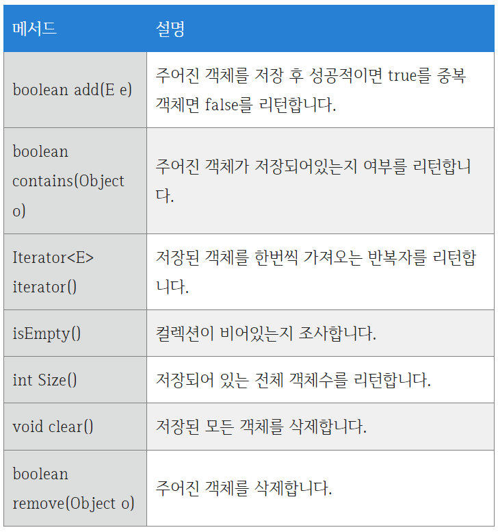

# Set

Set 컬렉션은 저장 순서가 우지되지 않는다. 또한 객체를 중복해서 저장할 수 없고 하나의 null 만 저장할 수 잇따. Set 컬렉션은 수학의 집합에 비유된다.
또한 구슬 주머니로 유사할 수 있다. 동일한 구슬을 두개 넣을 수 없으며, 저장할 때와 찾을 때의 순서가 다를 수 있다.
<br><br>

<br><br>
Set 컬레게션에는 HashSet, LinkedHashSet,TreeSet 등이 있는데 Set 컬렉션에서 공통적으로 사용가능한 Set 인터페이스의 메서드는 다음과 같다. 인떽스로 관리하지 않기 때문에 인덱스를 매개값을 갖는 메소드가 없다.
<br><br>

<br><br>

## HashSet
Set 컬렉션 중에서 가장 많이 사용되는 것이 HashSet  이다. 다음은 HashSet 컬렉션을 생성하는 방법이다.
```java
Set<E> set = new HashSet<E>(); // E에 지정된 타입의 객체만 저장
Set<E> set = new HashSet<>(); // E에 지정된 타입의 객체만 저장
Set set = new HashSet();      // 모든 타입의 객체를 저장
```

타입 파라미터 E에는 HashSet 에 저장하고 싶은 객체타입을 지정하면 된다. Set 에 지정한 객체 타입과 동일 하다면 HashSet<>과 같이 객체타입을 생략할 수 도 있다. 갹채 터압울 모두 생략허면 모든 종류의 객체를 저장할 수 있다.
HashSet은 동일한 객체는 중복 저장하지 않는다. 여기서 동일한 객체란 동등 객체를 말한다.
HashSet 은 다른 객체라도 !) hashCode()메서드의 리턴값이 같고, 2) equals()매서드가 true를 리턴하면 동일한 객체라고 판단하고 중복 저장하지 않는다.
<br><br>

<br><br>
문자열을 HashSet에 저장할 경우, 같은 문자열을 갖는 String 객체는 동등한 객체로 간주한다. 같은 문자열이면 hashCode()의 리턴값이 같고 equals()의 리턴값이 true가 나오기 때문이다.

Set 컬렉션은 인덱스로 객체를 검색해서 가져오는 메서드가 없다. 대신 객체를 한개씩 반복해서 가져와야 한다.

```java
import java.util.HashSet;
import java.util.Set;

Set<E> set = new HashSet<>();
for(E e:set) {
        ....
        }
```
<br>

```java
import java.util.HashSet;
import java.util.Iterator;
import java.util.Set;

Set<E> set = new HashSet<>();
Iterator<E> iterator = set.iterator();

```

iterator 는 Set의 객체를 가져오거나 제거하기 위해 다음 메소드를 제공한다.
<br><br>

<br><br>
사용 방법은
```java
while(iterator.hasNext() {
    E e = iterator.next();
}
```
<br>
hasNext() 매소드로 가져올 객체가 있는지 먼저 확인하고 true 를 리턴할 때만 next()메소드로 객체를 가져온다. 만약 next() 로 가져온 객체를 컬렉션에서 제거하고 싶다면 remove() 메서드를 사용한다.
