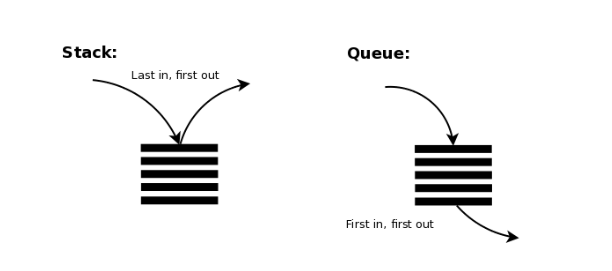

# LIFO 후입선출, Last In First Out
나중에 넣은 객체가 먼저 빠져나가는 구조이다.

# FIFO, 선입선출, First In First Out
먼저 넣은 객체가 먼저 빠져나가는 구조이다.
<br><br>
컬렉션 프레임 워크는 LIFO 자료구조를 제공하는 Stack 클래스와 FIFO 자료구조를 제공하는 Queue 인터페이스를 제공하고 있다.
<br><br>

<br><br>
스택을 응용한 대표적인 예가 JVM 스택 메모리다. 스택 메모리에 저장된 변수는 나중에 저장된 것부터 제거된다.<br>
큐를 응용한 대표적인 예가  스레드풀(ExecutorService)의 작업 큐이다. 작업 큐는 먼저 들어온 작업부터 처리한다.

## Stack
Stack 클래스는 LIFO자료구조를 실현한 클래스이다.
 생성하는 방법은 다음과 같다.

```java
import java.util.Stack;

Stack<E> stack = new Stack<E>();
Stack<E> stack = new Stack<>();

```

주요메소드는 다음과 같다.
<table>
    <tr><td>리턴타입</td> <td>메소드</td> <td>설명</td></tr>
    <tr><td>E</td> <td>push(E item)</td> <td>주어진 객체를 스택에 넣는다.</td></tr>
    <tr><td>E</td> <td>pop()</td> <td>스택의 맨 위 객체를 빼낸다.</td></tr>
</table>

디음 Coin클래스는 동전 케이스를 Stack 클래스로 구현한 예제이다. 
동전 케이스는 위에만 오픈되어 있는 스택구조를 가지고 있다. 먼저 넣은 동전은 제일 밑에 갈리고 나중에 넣은 동전이 위에 쌓이기 때문에 제일 위의 동전부터 빼낼 수 있다


## Queue
Queue 인터페이스는 FIFO 자료구조에서 사용되는 메소드를 정의하고 있다. 다음은 Queue 인터페이스에 정의되어 있는 메소드이다.
<table>
    <tr><td>리턴 타입</td><td>메소드</td><td>설명</td></tr>
    <tr><td>boolean</td><td>offer(E e)</td><td>주어진 겍체를 큐에 넣는다.</td></tr>
    <tr><td>E</td><td>poll()</td><td>큐에서 객체를 빼낸다.</td></tr>
</table>

Queue 인터페이스를 구현한 대표적인 클래스는 LinkedList이다. 
그렇기 때문에 LinkedList 객체를 Queue 인터페이스 변수에 다음과 같이 대입할 수 있다.

```java
import java.util.LinkedList;

Queue<E> queue = new LinkedList<E>();
Queue<E> queue = new LinkedList<>();

```

다음 Message클래스는 Queue를 이용해서 간단한 메세지 큐를 구현한 예제이다.
먼저 넣은 메세지가 반대쪽으로 먼저 나오기 때문에 넣은 순서대로 메세지가 처리된다.
