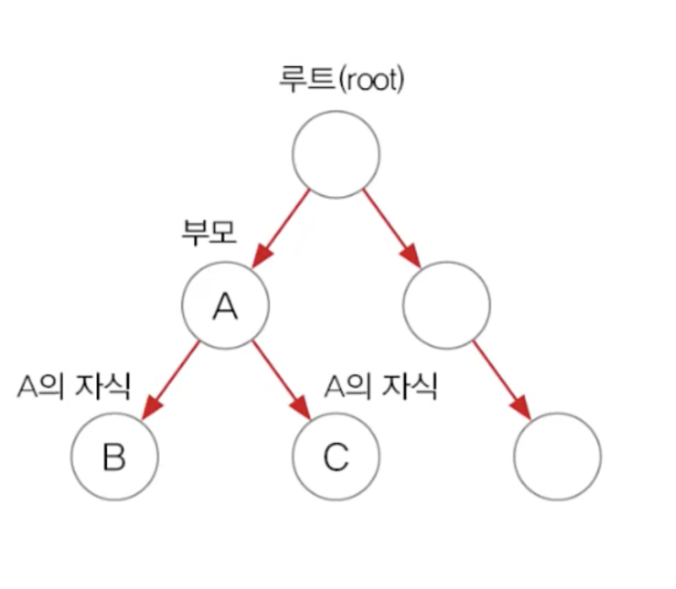
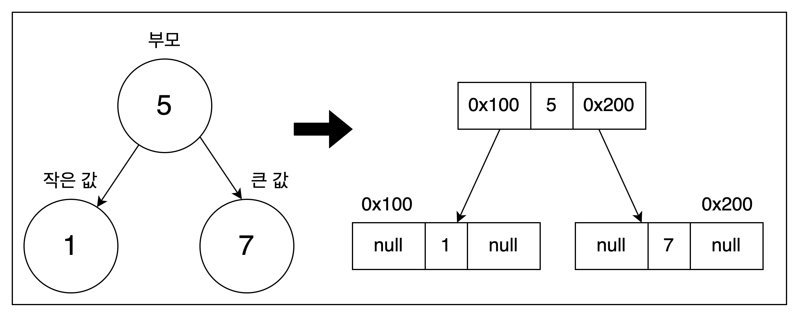
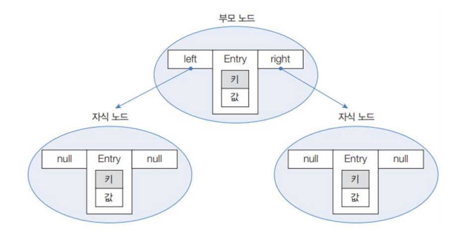

# 검색 기능을 강화시킨 컬렉션
## TreeSet
Set 컬렉션이다.
Binary Tree(이진 트리)를 기반으로 한 Set 컬렉션이다.
이진 트리는 여러 개의 노드가 트리 형태로 연결된 구조로 루트 노드(Root Nood)라 불리는 하나의 노드에서 시작해 각 노드에 푀대 2개의 노드를 연결할 수 있는 구조를 가지고 있다.
 

가운데 값은 객체의 자리이고 left, right로 구분된다. TreeSet에 객체를 저장하면 다음과 같이 자동으로 정렬된다.
부모 노드의 객체와 비교해서 낮은 것은 왼쪽 자식 노드에서 높은 것은 오른쪽 자식 노드에 저장한다.

```java
import java.util.TreeSet;

TreeSet<E> treeSet = new TreeSet<E>();
TreeSet<E> treeSet = new TreeSet<>();
```

Set 타입 변수에 대입해도 되지만 TreeSet 타입으로 대입한 이유는 검색 관련 메소드가 TreeSet에만 정의되어 있기 때문이다.
다음은 TreeSet이 가지고 있는 검색 관현 메소드들이다.
<table>
<tr><td>리턴 타입</td><td>메소드</td><td>설명</td></tr>
<tr><td>E</td> <td> first() </td><td>제일 낮은 객체를 리턴</td></tr>
<tr><td>E</td> <td> last() </td><td>제일 높은 객체를 리턴</td></tr>
<tr><td>E</td> <td> lower(E e) </td> <td>주어진 객체보다 바로 아래 객체를 리턴</td></tr>
<tr><td>E</td> <td> higher(E e) </td> <td>주어진 객체보다 바로 위 객체를 리턴</td></tr>
<tr><td>E</td> <td> floor(E e) </td> <td> 주어진 객체와 동긍한 객체가 있으면 리턴, 만약 없다면 주어진 객체의 바로 아래의 객체를 리턴 </td></tr>
<tr><td>E</td> <td> ceiling(E e) </td> <td> 주어진 객체와 동등한 객체가 있으면 리턴, 만약 없다면 주어진 객체의 바로 위의 객체를 리턴 </td></tr>
<tr><td>E</td> <td> pollFirst() </td> <td> 제일 낮은 객체를 꺼내오고 컬렉션에서 제거함 </td></tr>
<tr><td>E</td> <td> pollLast() </td> <td> 제일 높은 객체를 꺼내오고 컬렉션에서 제거함 </td></tr>
<tr><td> Iterator<E> </td> <td> descendingIIterator() </td> <td> 내림차순으로 정렬된 Iterator를 리턴 </td></tr>
<tr><td> NavigableSet<E> </td> <td> descendingSet() </td> <td> 내림차순으로 정렬된 NavigableSet을 리턴 </td></tr>
<tr><td> NavigableSet<E> </td> <td> headSet( EtoElement, boolean inclusive) </td> <td> 주어진 객체보다 낮은 객체들을 NavigableSet으로 리턴, 주어진 객체 포함 여부는 두번째 매개갑에 따라 달라짐 </td></tr>
<tr><td> NavigableSet<E> </td> <td> tailSet(E from Element, boolean inclusive) </td> <td> 주어진 객체보다 높은 객체들을 NavigableSet으로 리턴, 주어진 객체 포함 여부는 두번째 매개갑에 따라 달라짐 </td></tr>
<tr><td> NavigableSet<E> </td> <td> subSet(E from Element, boolean fromInclusive, E toElement, boolean toInclusive </td> <td> 시작과 끝으로 주어진 객체 사이의 객체들을 NavigableSet으로 리턴, 시작과 끝 객체의 포함여부는 두번째, 네번째 매개값에 따라 달라짐 </td></tr>
</table>


## TreeMap
Map 컬렉션이다. 이진 트리를 기반으로 한  Map 컬렉션이다. TreeSet과의 차이점은 키와 값이 저장된 Entry를 저장한다는 점이다.
TreeMap에 엔트리를 저장하면 키를 기준으로 자동 정렬되는데 , 부모 키 값과 비교해서 낮은 것은 왼쪽, 높은 것은 오른쪽 자식 노드에 Entry 객체를 저장한다.

<br>
TreeSMap 컬렉션을 생성하는 방법이다
```java
TreeMap<K, V> treeMap = new TreeMap<K, V>();
TreeMap<K, V> treeMap = new TreeMap<>();
```
Map 타입 변수에 대입해도 되지만, TreeMap 타입으로 대입한 이유는 검색관련 메소드가 TreeMap에만 정의되어 있기 때문이다. 
다음은 TreeMap이 가지고 있는 검색 관련 메소드들이다.

<table>
<tr><td>리턴 타입</td><td>메소드</td><td>설명</td></tr>
<tr><td>Map.Entry(K,V)</td> <td> firstEntry() </td><td>제일 낮은 Map.Entry를 리턴</td></tr>
<tr><td>Map.Entry(K,V)</td> <td> lastEntry()</td><td>제일 높은 Map.Entry를 리턴</td></tr>
<tr><td>Map.Entry(K,V)</td> <td> lowerEntry(K Key) </td> <td>주어진 키보다 바로 아래 Map.Entry 리턴</td></tr>
<tr><td>Map.Entry(K,V)</td> <td> higherEntry(K key) </td> <td>주어진 키보다 바로 위 Map.Entry 리턴</td></tr>
<tr><td>Map.Entry(K,V)</td> <td> floorEntry(K Key) </td> <td> 주어진 키와 동등한 키가 있으면 해당 Map.Entry를 리턴, 없다면 주어진 키 바로 아래의 Map.Entry를 리턴 </td></tr>
<tr><td>Map.Entry(K,V)</td> <td> ceilingEntry(K Key) </td> <td> 주어진 키와 동등한 키가 있으면 해당 Map.Entry를 리턴, 없다면 주어진 키 바로 위의 Map.Entry를 리턴 </td></tr>
<tr><td>Map.Entry(K,V)</td> <td> pollFirstEntry() </td> <td> 제일 낮은 Map.Entry를 꺼내오고 컬렉션에서 제거함 </td></tr>
<tr><td>Map.Entry(K,V)</td> <td> pollLastEntry() </td> <td> 제일 높은 Map.Entry를 꺼내오고 컬렉션에서 제거함 </td></tr>
<tr><td> NavigableMap(K,V) </td> <td> descendingMap() </td> <td> 내림차순으로 정렬된 Map.Entry의 NavigableMap을 리턴 </td></tr>
<tr><td> NavigableMap(K,V) </td> <td> headSet(K to Key, boolean inclusive) </td> <td> 주어진 키보다 낮은 Map.Entry들을 NavigableMap으로 리턴, 주어진 Map.Entry 포함 여부는 두번째 매개갑에 따라 달라짐 </td></tr>
<tr><td> NavigableMap(K,V) </td> <td> tailMap(K from Key, boolean inclusive) </td> <td> 주어진 객체보다 높은 Map.Entry들을 NavigableMap으로 리턴, 주어진 Map.Entry 포함 여부는 두번째 매개갑에 따라 달라짐 </td></tr>
<tr><td> NavigableMap(K,V) </td> <td> subMap(K from Key, boolean fromInclusive,K toKey, boolean toInclusive </td> <td> 시작과 끝으로 주어진 객체 사이의 Map.Entry들을 NavigableMap으로 반환, 시작과 끝 Map.Entry 포함여부는 두번째, 네번째 매개값에 따라 달라짐 </td></tr>
</table>
Map.Entry(K,V) 와 NavigableMap(K,V)는 <K,V>로 표기한다.
