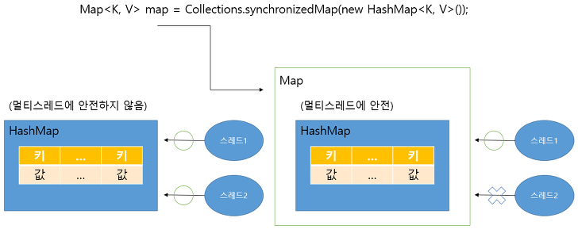

# 동기화된 컬렉션
컬렉션 프레임 워크의 대부분 클래스들은 싱글 스레드 환경에서 사용할 수 있도록 설계되었다. 그렇기 때문에 여러 스레드가 종시에 컬렉션에 접근한다면 의도하지 않게 요소가 변경될 수 있는 불안전한 상태가 된다.<br>
Vector와 Hashtable 은 동기화된 메소드로 구성되어 있기 때문에 멀티 스레드 환경에서 안전하게 요소를 처리할 수 있지만, ArrayList와 HashSet, HashMap은 동기화된 메소드로 구성되어 있지 않아 멀티 스레드 환경에서 안전하지 않다.<br>
경우에 따라서는 ArrayList, HashSet, HashMap을 멀티 스레드 환경에서 사용하고 싶을 때가 있을 것이다. 이런 경우를 대비해서 컬렉션 프레임 워크는 비동기화된 메소드를 동기화된 메소드로 래핑하는 Collections의 synchronizedXXX()메소드를 제공한다.

<table>
    <tr><td> 리턴 타입 </td> <td> 메소드(매개변수) </td> <td> 설명 </td></tr>
    <tr><td> List(T) </td> <td> synchronizedList(List(T) list) </td> <td> List를 동기화된 List로 리턴 </td></tr>
    <tr><td> Map(K,V) </td> <td> synchronizedMap(Map(K,V) m) </td> <td> Map을 동기화된 Map으로 리턴 </td></tr>
    <tr><td> Set(T) </td> <td> synchronizedSet(Set(T) s) </td> <td>  Set을 동기화된  Set으로 리턴 </td></tr>
</table>

이 매소드들은 매개값으로 비동기화된 컬렉션을 대입하면 동기화된 컬렉션을 리턴한다. 다음 코드는 ArrayList 를 Collections.synchronizedList() 메소드를 사용해서 동기화된  List로 변환한다.

```java
import java.util.ArrayList;
import java.util.Collections;

List<T> list = Collections.synchronizedList(new ArrayList<T>());
```


다음 코드는 HashSet을 Collections.synchronizedSet()메소드를 사용해서 동기화된 Set으로 변환한다.

```java
import java.util.Collections;
import java.util.HashSet;

Set<E> set = Collections.synchronizedSet(new HashSet<E>());
```


다음 코드는 HashMap을 Collections.synchronizedMap()매소드를 사용해서 동기화된 Map으로 변환한다.

```java
import java.util.Collections;
import java.util.HashMap;

Map<K, V> map = Collections.synchronizedMap(new HashMap<K, V>());
```


SynchronizedMapExample 클래스는 ThreadA와 B에서 동시에 Borad 객체를 HashMap에 각각 1000개씩 추가한 후, 전체 저장된 수를 출력하는 예제다.
HashMap 은 두 스레드가 동시에 put() 메소드를 호출할 수 있기 때문에 경합이 발생해 결국 하나만 저장되기 떄문이다. 하지만 동기화된 Map은 한번에 하나의 스레드만 put()메소드를 호출할 수 있기 때문에 경합이 발생하지 않는다.
