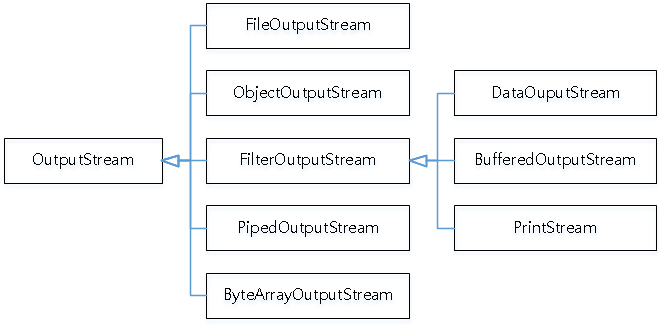
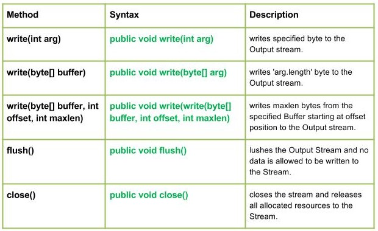
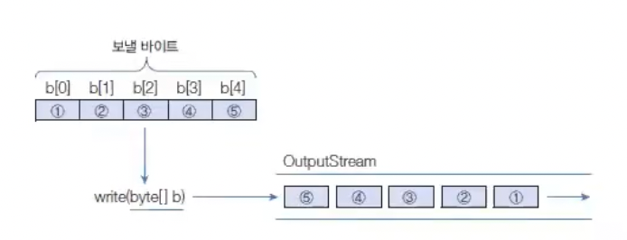
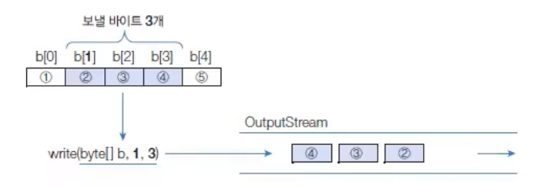

# 바이트 출력 스트림
OutputStream은 바이트 출력 스트림의 최상위 클래스로 추상 클래스다.
모든 바이트 출력 스트림 클래스는 이 OutputStream  클래스를 상속받아서 만들어진다.
 
OutputStream클래스의 주요 메소드는 다음과 같다.

설명을 쭉 보자면,  
- write(int b) : 1 byte 출력
- write(byte [] b) : 매개값으로 주어진 배열 b의 모든 바이트를 출력
- write(byte []b, int off, int len) : 매개값으로 주어진 배열 b[off]부터 len개의 바이트 출력
- flush() : 출력 버퍼에 잔류하는 모든 바이트를 출력
- close() : 출력 스트림을 닫고 사용 메모리 해제

## 1 byte 출력
write(int b)메소드는 매개값 int(4 byte)에서 끝인 1byte 만 출력한다.
매개변수가 int 타입이므로 4byte 모두를 보내는 것은 아니다.

FileOutputStream 생성자는 주어진 파일을 생성할 수 없으면 IOException을 발생시킨다.
write(), flush(), close() 메소드도 IOException 이 발생할 수 있으므로 예외처리를 해야한다.
OutputStream은 내부에 작은 버퍼를 가지고 있다. write() 메소드가 호출되면 버퍼에 바이트를 우선 저장하고 버퍼가 차면 순서대로 바이트를 출력한다. 
flush() 메소드는 내부 버퍼에 잔류하는 모든 바이트를 출력하고 버퍼를 비우는 역할을 한다.
내부 버퍼를 사용하는 이유는 출력 성능을 향상하기 위해서다.
출력 스트림을 더이상 사용하지 않을 때에는 close() 메소드를 호출해서 출력 스트림이 사용했던 메모리를 해제하는 것이 좋다.

## 바이트 배열 출력
일반적으로 1 바이트를 출력하는 경우는 드물고 보통 바이트 배열을 통째로 출력하는 경우가 많다.
write(byte []b) 메소드는 매개값으로 주어진 배열의 모든 바이트를 출력한다.
 

만약 배열의 일부분을 출력하고 싶다면 write(byte[] b, int off, int len)메소드를 사용하면 된다.
이 메소드는 b[off]부터 len개의 바이트를 출력한다.
