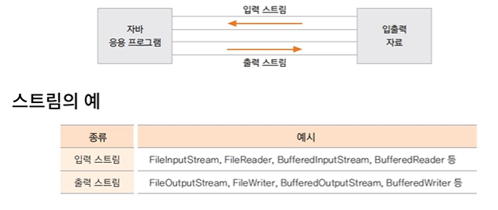
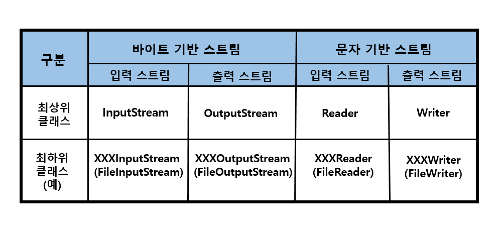

# 입출력 스트림
데이터의 입력은 키보드, 파일, 프로그램을 통해 입력된다.
출력은 모니터 츨략, 파일에 저장, 다른 프로그램으로 전송될 수 있다.
이것을 총칭해서 데이터 입출력이라 한다.
자바는 입력과 출력 스트림을 통해 데이터를 입출력한다.
Stream 은 단방향으로 데이터가 흐르는 것을 말하는데 데이터는 출발지에서 나와 도착지로 흘러간다.
프로그램이 다른 프로그램과 데이터를 교환하려면 양쪽 모두 입력 스트림과 출력 스트림이 필요하다.
  
어떤 데이터를 입출력하느냐에 따라 스트림은 두종류로 구분된다.
 
- 바이트 스트림 : 그림, 멀티 미디어, 문자 등 모든 종류의 데이터를 입출력할 때 사용
- 문자 스트림 : 문자만 입출력할 때 사용
자바는 데이터 입출력과 관련된 라이브러리를 java.io 패키지에서 제공하고 있다. java.io 패키지는 바이트 스트림과 문자 스트림을 다음과 같이 이름으로 구분해서 사용한다.
 
 
최상위 클래스는 InputStream, OutputStream이다. 이 클래스를 상속받는 자식 클래스에는 접미사로 InputStream, OutStream이 붙는다. 
- 예를 들어 이미지와 같은 바이너리 파일의 입출력 스트림 클래스는 FileInputStream, FileOutputStream 이다.  
문자 입출력 스트림의 최상위 클래스는 Reader, Writer이다. 이 클래스를 상속받는 하위 클래스에는 접미사로 Reader 또는 Writer 가 붙는다.
- 예를 들어 텍스트 파일의 입출력 스트림 클래스는 FileReader와 FileWriter 이다.

