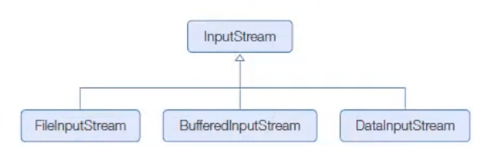
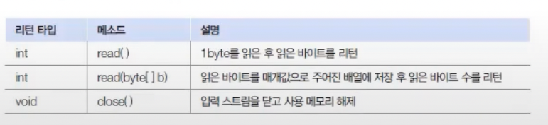
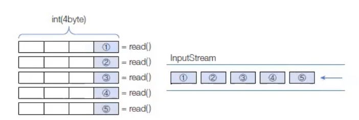
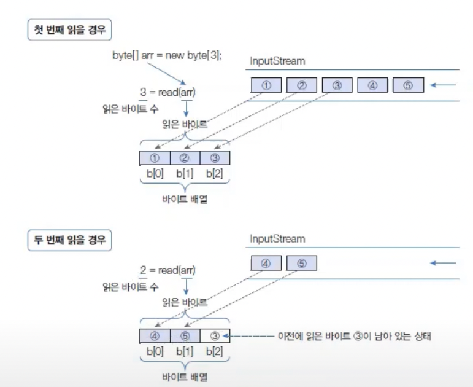

# 바이트 입력 스트림
InputStream은 바이트 이비력 스트림의 최상위 클래스로 추상 클래스이다.
모든 바이트 입력 스트림은 InputStream 클래스를 상속받아 만들어진다.
 <br>
InputStream클래스에는 바이트 입력 스트림이 기본적으로 가져야할 메소드가 정의 되어 있다.
다음은 InputStream 클래스의 주요 메소드이다.



## 1 Byte 읽기
read() 메소드는 입력 스트림으로부터 1byte를 익고 int(4byte) 타입으로 리턴한다. 땨라서 리천된 4 Byte 중 끝 1byte에만 데이터가 들어있다.
- 예를 들어 입력 스트림에서 5개의 바이트가 들어온다면 다음과 같이 read()메소드로 1 byte씩 5번 읽을 수 있다.

더 이상 입력 스트림으로부터 바이트를 읽을 수 없다면 read()메소드는 -1을 리턴하는데, 이것을 이용하면 읽을 수 있는 마지막 바이트까지 반복해서 한 바이트씩 읽을 수 있다.
```java
InputStream is =  ...;
while(true) {
    int data = is.read();
    if( data == -1) break;
}
```
ReadExample클래스를 보면, FileInputStream 생성자는 주어진 파일이 존재하지 않을 경우 FileNotFoundException을 발생시킨다.
그리고 read(), close() 메소드에서 IOException이 발생할 수 있으므로 두가지 예외를 모두 처리해야 한다.

## 바이트 배열로 읽기
read(byte[] b) 메소드는 입력 스트림으로부터 주어진 배열의 길이만큼 바이트를 읽고 배열에 저장한 다음 읽은 바이트 수를 리턴한다.
- 예를 들어 입력 스트림에 5개의 바이트가 들어오면 다음과 같이 길이 3인 배열로 두번 읽을 수 있다.
  
read(byte[] b) 역시 입력 스트림으로부터 바이트를 더 이상 읽을 수 없다면 -1 을 리턴하는데 이것을 이용하면 읽을 수 있는 마지막 바이트까지 반복해서 읽을 수 있다.

```java
import java.io.InputStream;

InputStream is = ---;
byte[] data = new byte[100];
while(true) {
    int num = is.read(data);
    if(num == -1) break;
}
```
많은 양의 바이트를 읽을 때는 read(byte[] b) 메소드를 사용하는 것이 좋다.
입력 스트림으로부터 100개의 바이트가 들어온다면 read()메소드는 100번을 반복해서 읽어야 하지만, read(byte[] b) 메소드는 한번 읽을때 배열 길이만큼 읽기 때문에 읽는 횟수가 현저히 줄어든다.


## 파일 복사
파일 복사의 원리는 FileInputStream에서 읽은 바이트를 바로 FileOutputStream으로 출력하는 것이다.
Java9부터 좀더 편리하게 입력스트림에서 출력스트림으로 바이트를 복사하는 transferTo() 메소드가 InputStream에 추가 되었다.

