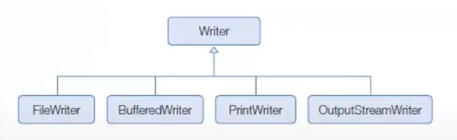
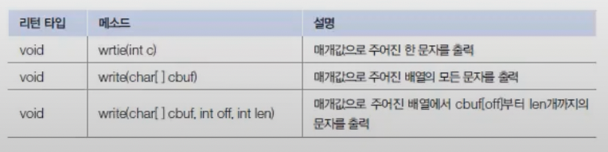
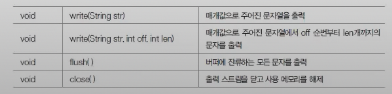
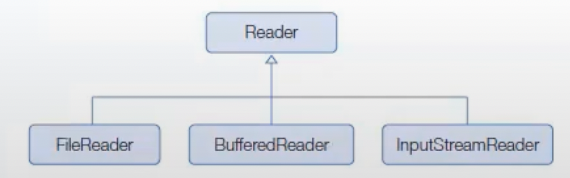
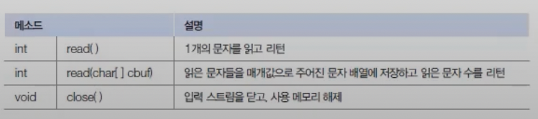

# 문자 입출력 스트림
문자 입출력 스트림에는 Raader 와 Writer 가 있다. 입출력되는 다위가 문자인 것을 제외하고는 바이트 입출력 스트림과 사용 방법이 동일하다.

## 문자 출력
 Writer 는 문자 출력 스트림의 최상위 클래스로 추상클래스이다. 모든 문자 출력 스트림 클래스는 Writer클래스를 상속받아서 사용한다.
 
 
Writer클래스는 모든 문자 출력 스트림이 기본적으로 가져야 할 메소드가 정의되어 있다. 
Writer 클래스의 주요 메소드는 다음과 같다.

writer는 Outputstream과 사용방법이 동일하지만 출력 단위가 문자(Char)이다. 그리고 문자열을 출력하는
write(String str) 메소드를 추가로 제공한다.

## 문자 읽기
Reader 는 문자 입력 스트림의 최상위 클래스로 추상 클래스 이다. 모든 문자 입력 스트림 클래스는 Reader 클래스를 상속 받아서 만들어진다.

Reader 클래스에는 문자 입력 스트림이 기본적으로 가져야할 메소드가 정의되어 있다. 다음은  Reader 클래스의 주요 메소드다.

Reader 는 InputStream 과 사용 방법은 동일하지만 출력단위가 문자(Char)이다.
