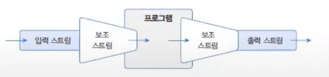
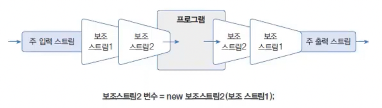
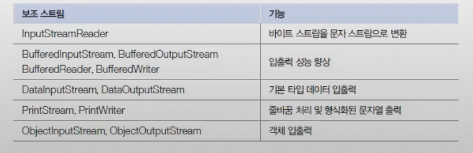
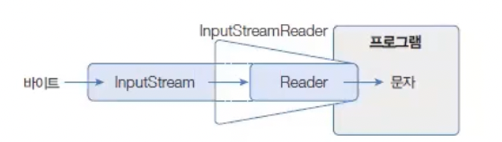
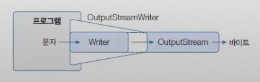

# 보조 스트릠
보조 스트림이란 다른 스트림과 연결되어 여러 가지 편리한 기능을 제공해주는 스트림을 말한다.
보조 스트림은 자체적으로 입출력을 수행할 수 없기 때문에 입출력 소스로부터 직접 생성된 입출력 스트림에 연결해서 사용해야 한다.
입출력 스트림에 보조 스트림을 연결할려며녀 보조 스트림을 생성할때 생성자 매개값으로 입출력 스트림을 제공하면 된다.

```markdown
보조 스트림 변수 = new 보조 스트림(입출력 스트림);
```

예를 들어 바이트 입력 스트림인 FileInputStream 에 InputStreamReader 보조스트림을 연결하는 코드를 보자

```java
import java.io.FileInputStream;
import java.io.InputStreamReader;

InputStream is = new FileInputStream("...");
InputStreamReader reader = new InputStreamReader(is);
```
보조 스트림은 또 다른 보조 스트림과 연결되어 스트림 체인으로 구성할 수 있다.

예를 들어 문자 변환 보조 스트림인 InputStreamReader에 BufferedReader 보조 스트림을 연결하는 코드는 다음과 같다

```java
import java.io.BufferedReader;
import java.io.FileInputStream;
import java.io.InputStreamReader;

InputStream is = new FileInputStream("///");
InputStreamReader reader = new InputStreamReader(is);
BufferedReader br = new BufferedReader(reader);
```
자주 사용되는 보조 스트림은 다음과 같다.



## 문자 변환 스트림
바이트 스트림( InputStream, OutputStream) 에서 입출력할 데이터가 문자라면 문자 스트림(Reader와 Writer )로 변환해서 사용하는 것이 좋다.
그 이유는 문자로 바로 입출력하는 편리함이 있고 문자셋의 종류를 지정할 수 있기 때문이다.

### InputStream을 Reader 로 변환
Inputstream을 Reader로 변환하려면 InputStreamReader  보조 스트림을 연결하면 된다.


다음은 InputStream 을 Reader 로 변환하는 코드를 보여준다.

```java
import java.io.InputStreamReader;

InputStream is = new FileInputStream("D:/Test/test.txt");
Reader reader = new InputStreamReader(is);
```
*  FileReader의 원리 : FileReader가 내부적으로 FileInputStream에 InputStreamReader 보조 스트림을 연결한 것이다.
* FileInputStream에 InputStreamReader 를 연결하지 않고 FileReader를 직접 생성할 수 있는 것은 FileReader 는 InputStreamReader의 자식 클래스이기 때문이다.

### OutputStream을 Writer로 변환
OutputStream을 Writer 로 변환하려면 OutputStreamWriter 보조 스트림을 연결하면 된댜.

다음은 OutputStream을 Writer로 변환하는 코드를 보여준다.

```java
import java.io.FileOutputStream;
import java.io.OutputStreamWriter;

OutputStream os = new FileOutputStream("D:/Test/test.txt");
Writer writer = new OutputStreamWriter(os);
```
 * FileWriter 의 원리 : FileWriter 는 OutputStreamWriter의 자식 클래스다. 이것은 FileWriter 가 내부적으로 FileOutputStream에 OutputStreamWriter 보조 스트림을 연결한 것이라 볼 수 있다.

