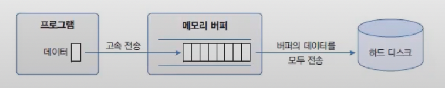
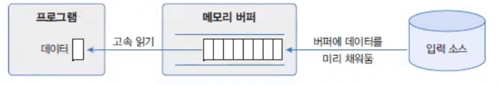

# 성능 향상 스트림
CPU와 메모리가 아무리 뛰어나도 하드 디스크의 입출력이 늦어지면 프로그램 실행 성능은 하드디스크의 처리속도에 맞춰진다.
이 문제에 대한 완전한 해결책은 아니겟지만 프로그램이 입출력 소스와 직접 작업하지 않고 중간에 메모리 버퍼와 작업함으로써 실행성능을 향상시킬 수 있다.

출력 스트림의 경우 직업 하드 디스트에 데이터를 보내지 않고 메모리 버퍼에 데이터를 보냄으로써 출력 속도를 향상시킬 수 잇다. 
버퍼는 데이터가 쌓이기를 기다렸다가 꽉 차게 되면 데이터를 한꺼번에 하드 디스크로 보냄으로써 출력 횟수를 줄여준다.

입력 스트림에서도 버퍼를 사용하면 읽기 성능이 좋아진다. 하드 디스크로부터 직접 읽는 것보다는 메모리 버퍼로부터 읽는 것이 빠르다.

위와 같이 메모리 버퍼를 제공하여 프로그램의 실행 성능을 향상시키는 보조 스트림이 있다. 바이트 스트림에는 BufferedInputStream, BufferedOutputStream  이 있고 문자 스트림에는 BufferedReader, BufferedWriter 가 있다.
보조 스트림을 연결하는 방법은 다음과 같다.

```java
import java.io.BufferedInputStream;
import java.io.BufferedOutputStream;
import java.io.BufferedReader;
import java.io.BufferedWriter;

BufferedInputStream bis = new BufferedInputStream(바이트 입력 스트림);
BufferedOutputStream bos = new BufferedOutputStream(바이트 출력 스트림);


BufferedReader br = new BufferedReader(문자 입력 스트림);
BufferedWriter bw = new BufferedWriter(문자 출력 스트림);
```


