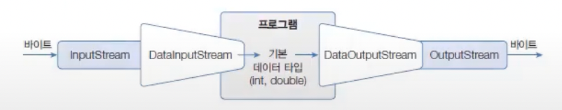
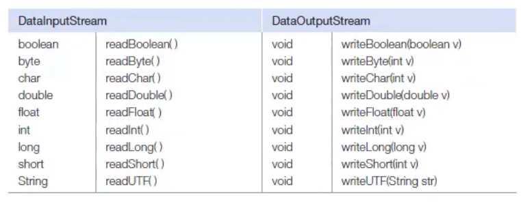

# 기본 타입 스트림
바이트 스트림에 DataInputStream과 DataOutputStream 보조 스트림을 연결하면 기본 타입인 boolean, char, short, int, long, float, double값을 입출력할 수 있다.

다음은 DataInputStream과 DataOutputStream 보조 스트림을 연결하는 코드이다.

```java
import java.io.DataInputStream;
import java.io.DataOutputStream;

DataInputStream dis = new DataInputStream(바이트 입력 스트림);
DataOutputStream dos = new DataOutputStream(바이트 출력 스트림);
```
DataInputStream과 DataOutputStream이 제공하는 메소드이다.


데이터 타입의 크기가 모두 다르므로 DataOutputStream 으로 출력한 데이터를 다시 DataInputStream 으로 읽어 올때에는 출력한 순서와 동일한 순서로 읽어야하는 주의점이 있다.
- 예를 들면 출력 순서가  int-boolean-double이라면 읽을때 순서도  int-boolean-double 이어야 한다.
