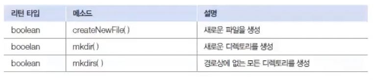
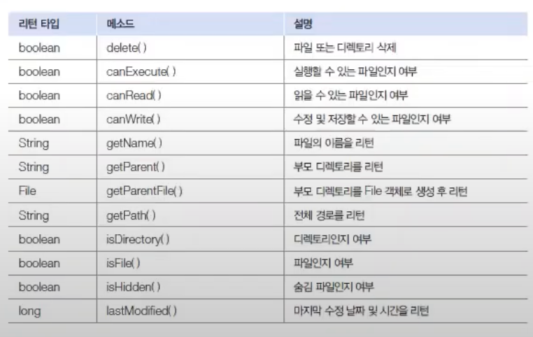
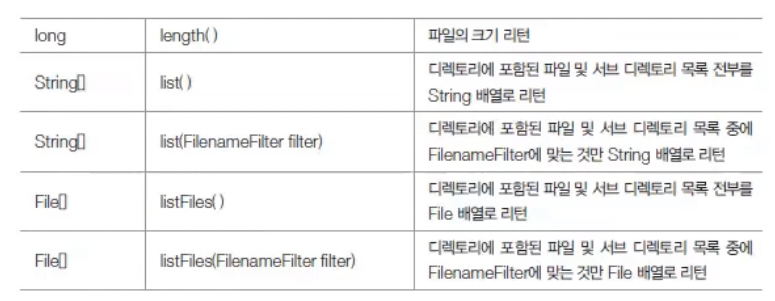
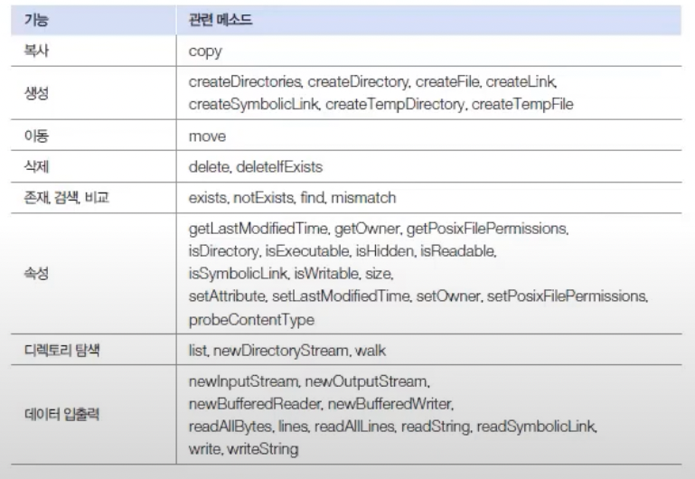

# File과 File Class 

java.io패키지와 java.nio.file패키지는 파일과 디렉토리 정보를 가지고 있는 File과 Files 클래스를 제공한다.
Files는 File을 개선한 클래스로 좀 더 많은 기능을 가지고 있다.

## File클래스
File 클래스로부터 File객체를 생성하는 방법은 다음과 가탇.
```markdown
File file = new File("경로");
```

경로 구분자는 운영체제마다 조금씩 다르다. 윈도우에서는 \\또는 /를 둘다 사용할 수 있고, 맥 OS 및 리눅스에서는 /를 사용한다.
다음은 윈도우에서 File 객체를 생성하는 코드이다.
```markdown
File file  = new File("D:/Test/file.txt");
File file = new File("D:\\Test\\file.txt");
```
File 객체를 생성했다고 해서 파일이나 디렉토리가 생성되는 것은 아니다.
 그리고 경로에 실제 파일이나 디렉토리가 없더라도 예외가 발생하지 않는다.
파일이나 디렉토리가 실제 있는지 확인하고 싶다면 File 객체를 생성하고 나서 exists() 메소드를 호출해보면 된다.
```markdown
boolean isExist = file.exists(); // 파일이나 폴더가 존재한다면 true를 리턴
```

exists() 메소드가 false를 리턴할 경우, 다음 메소드로 파일 또는 폴더를 생성할 수 있다.


exists()메소드의 리턴값이 true라면 다음 메소드를 사용할 수 있다.



## Files 클래스
Files 클래스는 정적 메소드로 구성되어 있기 때문에 File 클래스처럼 객체로 만들 필요가 없다.  Files 의 정적 메소드는 운영체제의 파일 시스템에게 파일 작업을 수행하도록 위임한다.
다음은 Files 클래스가 가지고 있는 정적 메소드를 기능별로 정리한 표이다.

이 메소드들은 매개값으로  Path 객체를 받는다. Path 객체는 파일이나 디렉토리를 찾기위한 경로 정보를 가짖고 있는데 정적 메소드인 get()메소드로 다음과 같이 얻을 수 잇다.
```markdown
Path path = Paths.get(String first, String ... more) 
```
get()메소드의 매개값은 파일 경로인데, 전체 경로를 한꺼번에 지정해도 좋고 상위 디렉토리와 하위 디렉토리를 나열해서 지정해도 좋다.
파일의 경로는 절대 경로와 상대 경로를 모두 사용할 수 있다.
 

probeContentType()메소드는 파일 확장명에 따른 파일 유형을 리턴한다.
예를 들어 .txt 파일은 text/plain으로 jpg 파일은 image/jpeg 로 리턴한다.

Files는 입출력 스트림을 사용하지 않아도 파이리의 데이티를 쉽게 읽고 쓸 수 있다.
writeString() 메소드는 문자열을 파일에 저장하고 readString()메소드는 텍스트 파일의 내용을 전부 읽고 String 으로 리턴한다.