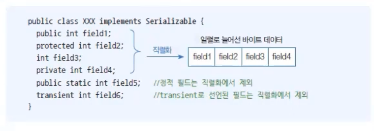
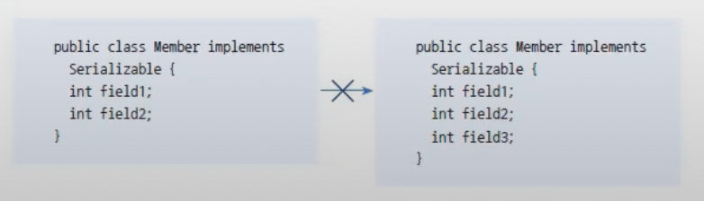

# 객체 스트림
자바는 메모리에 생성된 객체를 파일 또는 네트워크로 출력할 수 있다.
객체를 출력하려면 필드값을 일렬로 늘어선 바이트로 변경해야 하는데, 이것을 직렬화라고 한다.
반대로 직렬화된 바이트를 객체의 필드값으로 복원하는 것을 역직렬화라고 한다.
ObjectInputStream 과 ObjectOutputStream은 객체를 입출력할 수 있는 보조 스트림이다.
ObjectOutputStream은 바이트 출력 스트림과 연결되어 객체를 직렬화하고 ObjectInputStream은 바이트 입력 스트림과 연겨로디어 객체로 복원하는 역직렬화를 한다.

다음은 ObjectInputStream과 ObjectOutputStrea 보조 스트림을 연결하는 코드이다.
```java
ObjectInputStream ois = new ObjectInputStream(바이트 입력 스트림);
ObjectOutputStream oos = new ObjectOutputStream(바이트 출력 스트릠);
```
ObjectOutputStream으로 객체를 직렬화하기 위해서는 writeObject()메소드를 사용한다.
```java
oos.writeObject(객체);
```
반대로 ObjectInputStream의 readObject()메소드는 읽은 바이트를 역직렬화해서 객체로 생성한다.
readObject()a메소드의 리턴타입은 Object이므로 구체적인 타입으로 강제 타입 변환해야 한다.
```markdown
객체 타입 변수 = (객체타입) ois.readObject();
```

## Serializable 인터페이스
예제로 ObjectInputOutputStreamExample을 보면 Member, Product는 Serializable인터페이스를 구현하고 있다.
자바는 Serializable 인터페이스를 구현한 클래스만 직렬화 할 수 있도록 제한한다.
 Serializable 인터페이스는 멤버가 없는 빈 인터페이스지만 , 객체를 직렬화 할 수 있다고 표시하는 역할을 한다.
객체가 직렬화될때 인스턴스 필드값은 직렬화 대상이지만 정적 필드값과 transient로 선언된 필드값은 직렬화에서 제외되므로 출력되지 않는다.


## serialVersionUID 필드

직렬화할때 사용된 클래스와 역직렬화할때 사용된 클래스는 기본적으로 동일한 클래스여야 한다.
만약 클래스 이름이 같더라도 클래스의 내용이 다르면 역직렬화에 실패한다.
다음 코드를 보면 왼쪽 Member클래스로 생성한 객체를 직렬화하면 오른쪽 Member 클래스로 역직렬화할 수 없다.
그 이유는  오른쪽 Member 클래스에는 field3이 있기 때문이다.

클래스 내용이 다르다 할디라도 직렬화된 필드를 공통으로 포함하고 있다면 역직렬화할 수 있는 방법이 있다.
두 클래스가 동일한 serialVersionUID 상수값을 가지고 있으면 된다.

serialVersionUID 의 값은 개발자가 임의로 줄 수 있지만 가능하다면 클래스마다 다른 유일한 값을 갖도록 하는 것이 좋다.
이클립스는 serialVersionUID필드를 자동생성하는 기능을 제공한다.

