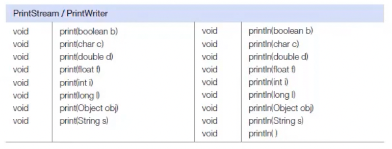

# 프린트 스트림

PrintStream, PrintWriter 는 프린터와 유사학세 출력하는 print(), println(), printf() 메소드를 가지고 있는 보조 스트림이다.
지금까지 우리는 콘솔에 출력하기 위해 System.out.println()을 주로 사용하였는데 이유는 out 이 PrintStream 타입이기 때문이다.
PrintStream 은 바이트 출력 스트림과 연결되고 PrintWriter는 문자 출력 스트림과 연결된다.

```java
 import java.io.PrintStream;
import java.io.PrintWriter;

PrintStream ps = new PrintStream(바이트 출력 스트릠);
PrintWriter pw = new PrintWriter(문자 출력 스트릠);
```

PrintStream과 PrintWriter 는 거의 같은 메소드를 가지고 있다. println()메소드는 출력할 데이터 끝에 줄바꿈 문자인 '\n' 을 더 추가시키기 때문에 콘솔이나 파일에서 줄바꿈이 일어난다.
그러나 print()메소드는 줄바꿈없이 계속해서 문자를 출력시킨ㄴ다. println()과 print()메소드는 출력할 데이터 타입에 따라 다음과  같이 재정의 된다.


printf()메소드는 형식화된 문자열을 출력한다.
