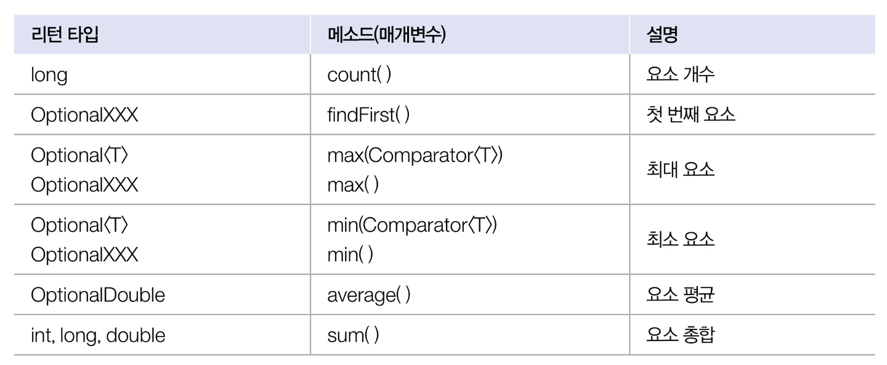
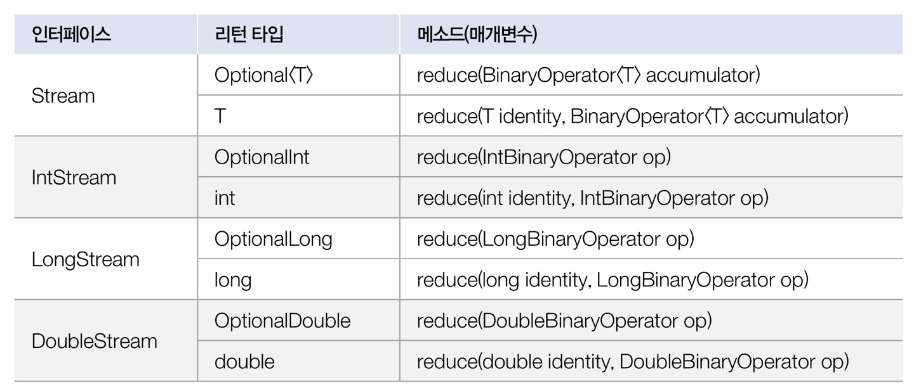
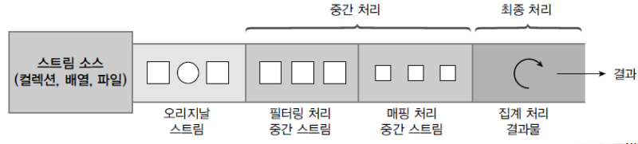
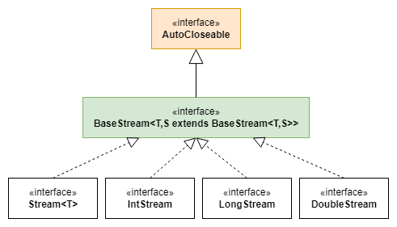
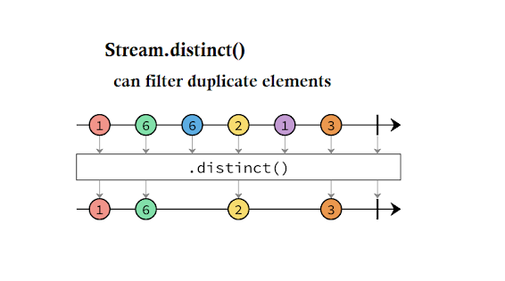
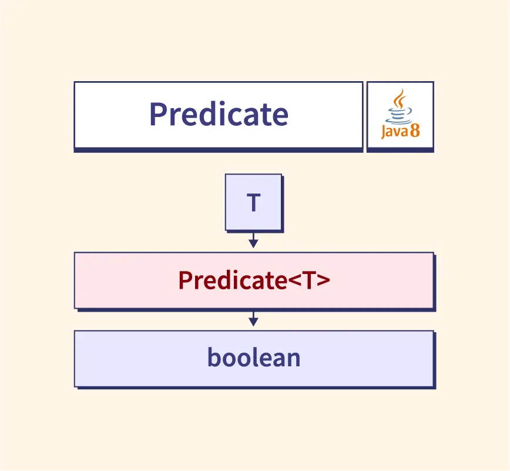

# Stream 이란?
 지금까지는 컭렉션 및 배열에 저장된 요소를 반복처리하기 위해 for문 ,  iterator 를 사용해 ㅆ따ㅣ
 List 컬렉션에서 요소흫 하나씩 처리하는 for문
 ```Java
 List<String> list = ...;
for(int i = 0; i < list.size(); i++) {
    Stream item = list.get(i);
   }
 ```
Set 에서 요소를 하나씩 처리하기 위해 Iterator를 다음과 같이 사용했다.
```Java
Set<String> set = ...;
Iterator<String> iterator = set.iterator();
while(iterator.hasNext()){
    String item = iterator.next();
    // 요소처리        
}
```

Java8부터 또다른 방법으로 컬렉션 및 배열의 요소를 반복처리하기 위해 Stream을 사용할 수 있다.
스트림은 요소들이 하나씩 흘러가면서 처리된다는 의미를 가지고 있다.
List컬렉션에서 요소를 반복처리하기 위해 스트림을 사용한다면 다음과 같다.

```Java
Stream<String> stream =  list.stream();
Stream.forEach( item -> ); //item 처리  
```
List() 컬렉션의 Stream() 메소드로 Stream 객체를 얻고 forEach() 메소드로 요소를 어떻게 처리할지ㄹ를 람다식으로 제공한다.
댜음 예제는  Set 컬렉션의 요소를 하나씩 읽고 출력하기 위해 스트림을 사용한다.

Stream 과 Iterator 는 비슷한 반복자이지만 다음과 같은 차이점이 있다.
```markdown
1. 내부 반복자이므로 처리 속도가 빠르고 병렬 처리에 효율적이다.
2. 람다식으로 다양한 요소 처리를 정의할 수 있다.
3. 중간 처리와 최종 처리를 수행하도록 파이프라인을 형성할 수 있다.
```


## 내부 반복자
for문, Iterator는 컬렉션의 요소를 컬렉션 바깥쪽으로 반복해서 가져와 처리하는데 이것을 외부 반복자라고 한다.
반면 스트림은 요소 처리 방법을 컬렉션내부로 주입시켜서 요소를 반복 처리하는데 이것을  내부 반복자라고 한다.

외부 반복자일 경우는 컬렉션의 요소를 외부로 가져오는 코드와 처리하는 코드를 모두 개발자 코드가 가지고 있어야 한다.
반면 내부 반복자는 개발자 코드에서 제공한 데이터 처리 코드(람다식)를 가지고 컬렉션 내부에서 요소를 반복처리한다.
내부 반복자는 멀티 코어  CPU 를 최대한 활용하기 위해 요소들을 분배시켜 병렬 작업을 할 수 있다.
하나씩 처리하는 순차적 외부 반복자보다는 효윻적으로 요소를 반복시킬 수 있는 장점이 있다.
<br><br>
ParallellStreamExample은 List 컬렉션의 내부 반복자를 이용해서 병렬 처리하는 방법을 알려주고 
parallelStream()메소드로 병렬 처리 스트림을 덩고 forEach() 메소드를 호출할 때 요소 처리 방법인
람다식을 제공한다. 람다식은 처리되는 요소가 무엇이고 어떤 스레드가 처리하는지 출력한다.


## 중간 처리와 최종 처리
스트림은 하나 이상 연결될 수 있다. 다음 그림을 보면 컬렉션의 오리지널 스트림 뒤에 필터링 중간 스트림이 연결될 수 있고  그  뒤에 매핑 중간 스트림이 연결될 수 있다.
이와 같이 스트림이 연결되어 있는 것을 스트림 파이프라인이라고 한다.<br>
<br><br>
오리지널 스트림과 집계 처리 사이의 중간 스트림은 최종 청리를 위해 요소를 걸러내거나(필터링), 요소를 변환하거나(매핑), 정렬 하는 작업을 한다.
최종 처리는 중간 처리에서 정제된 요소들을 반복하거낭 집계(카운팅, 총합, 평균) 작업을 수행한다.
다음은 Student 객체를 요소로 가지는 컬렉션에서 Student 스트림을 얻고 중간처리를 통해 score 스트림을 변환한 후 최종 집계로 score 평균을 구하는 과정을 나타낸 것이다.
```Java
//Stream
Stream<Student> studentStream = list.stream();
//stream
IntStream scoreStream = studentStream.mapToInt(student -> student.getScore());
//평균 계산
double avg = scoreStream.average().getAsDouble();
```
mapToInt() 메소드는 객체를 int값으로 매핑해서 IntStream으로 변환시킨다. 어떤 객체를 어떤 int 값으로 매핑할 것인지는 람다식으로 제공해야 한다.
student -> student.getScore()는 Student 객체를 getScore()의 리턴값으로 매핑한다. IntStream은 최종 처리를 위해 다양한 메소드를 제공하는데 , average() 메소드는 요소들의 평균값을 계산한다.
메소드 체이닝 패턴을 이용하면 더 간결하게 작성할 수 있다.
```markdown
double avg = list.stream()
    .mapToInt(student -> student.getScore())
    .average();
    .getAsDouble();
```
스트림 파이프라인으로 구성할때 주의점은 파이프라인의 맨 끝에는 반드시 최종 처리 부분이 있어야 한다는 것이다.
최종 처리가 없다면 오리지널 및 중간 처리 스트림은 동작하지 않는다. 즉, 위 코드에서 average() 이하를 생략하면 stream(), mapToInt()는 동작하지 않는다.


# 리소스로부터 스트림 얻기
java.until.stream  패키지에 스트림 인터페이스들이 있다. BaseStream을 부모로 한 자식 인터페이스들은 다음과 같은 상속 관계를 이룬다.
 <br>
BaseStream에는 모든 스트림에서 사용할 수 있는 공통 메소드들이 정의되어 있다.
Stream은 객체 요소를 처리하는 스트림이다. IntStream, Long Stream, DoubleStream 은 각각 기본 타입인 int, long ,double 요소를 처리하는 스트림이다.
이 스트림 인터페이스들의 구현 객체는 다양한 리소스로부터 얻을 수 있다. 
주로 컬렉션과 배열에서 얻지만 다음과  같은 리소스로부터 스트림 구현 객체를 얻을 수 있다.
<table>
<tr><td>리턴 타입</td> <td> 메소드(매개변수) </td> <td> 소스</td></tr>
<tr><td>Stream(T)</td> <td> java.util.Collection.stream() / java.util.Collection.parallelStream() </td> <td> List컬렉션 / Set컬렉션 </td></tr>
<tr><td>Stream(T) / IntStream / LongStream / DoubleStream </td> <td> Arrays.stream(T[]) , Stream.of(T[]) / Arrays.stream(int[]) , IntStream.of(int[]) / Arrays.stream(long[]) , LongStream.of(long[]) / Arrays.stream(double[]), DoubleStream.of(double[]) </td> <td> 배열</td></tr>
<tr><td>IntStream</td> <td> IntStream.range(int, int) / IntStream.rangeClosed(int, int) </td> <td>int 범위</td></tr>
<tr><td>LongStream</td> <td> LongStream.range(long, long) / LongStream.rangeClosed(long, long) </td> <td>long 범위</td></tr>
<tr><td>Stream(Path)</td> <td> File.list(Path) </td> <td>디렉토리</td></tr>
<tr><td>Stream(String)</td> <td> Files.lines(Path, Charset) </td> <td> 텍스트 파일</td></tr>
<tr><td>DoubleStream / IntStream / LongStream </td> <td> Random.doubles(....) / Random.ints() / Random.longs() </td> <td> 랜덤수</td></tr>
</table>

## 컬렉션으로부터 스트림 얻기
java.util.Collection  인터페이스는 스트림과 parallelStream() 메소드를 가지고 있기 때문에 자식 인터페이스인 List, Set 인터페이스를 구현한 모든 컬렉션에서 객체 스트림을 얻을 수 있다.
다음 Product 로 이어지는 예제는 List<Product> 컬렉션에서 Product 스트림을 얻는 방법을 보여준다.


## 배열로부터 스트림 얻기
java.util.Arrays 클래스를 이용하면 다양한 종류의 배열로부터 스트림을 얻을 수 있다. 
ArrayStreamExample 클래스를 보면 된다.

## 숫자 범위로부터 스트림 얻기
IntStream, LongStream 의 정적메소드이니 range()와 rangeClosed() 메소드를 이용하면 특정 범위의 정수 스트림을 얻을 수 있다. 첫번째 매개값은 시작 수이고 두번째 매개값은 끝수인데, 끝수를 포함하지 않으면, range(), 포함하면 rangeClosed() 를 사용한다.
IntStreamExample 클래스를 보면 된다.

## 파일로부터 스트림 얻기
java.nio.file.Files의 lines()메소드를 이용하면 텍스트 파일의 행단위 스트림을 얻을 수 있다. 이는 텍스트 파일에서 한 행씩 읽고 처리할때 우용하게 사용할 수 있따.
data.txt 파일과 FileStream 클래스 예제를 보면 된다.


# 요소 걸러내기 (필터링)
필터링은 요소를 걸러내는 중간처리 기능이다. 필터링 매소드에는  distinct()와 filter()가 있다.
<table>
<tr><td>리턴타입</td><td>메소드(매개변수)</td><td>설명</td></tr>
<tr><td>Stream / IntStream / LongStream / DoubleStream<td>distinct()</td><td>중복 제거</td></tr>
<tr><td>Stream / IntStream / LongStream / DoubleStream<td>filter(Predicate(T)) / filter(IntPredicate) / filter(LongPredicate) / filter(DoublePredicate) </td><td>조건 필터링, 매개 타입은 요소 타입에 따른 함수형 인터페이스이므로 람다식으로 작성 가능</td></tr>
</table>
distinct() 메소드는 요소의 중복을 제거한다.
객체 스트림일 경우, equals() 메소드의 리턴값이 true면 동일한 요소로 판단한다.
IntStream, LongStream, DoubleStream은 같은 값일 경우 중복을 제거한다.



filter()매소드는 매개값으로 주어진 Predicate 가 true 를 리턴하는 요소만 필터링 한다.


Predicate 는 함수형 인터페이스로 다음과 같은 종류가 있다.
<table>
<tr><td>인터페이스</td><td>추상 메소드</td><td>설명</td></tr>
<tr><td>Predicate(T)</td><td>boolean test(T t)</td><td>객체T를 조사</td></tr>
<tr><td>IntPredicate</td><td>boolean test(int value)</td><td>int 값을 조사</td></tr>
<tr><td>LongPredicate</td><td>boolean test(long value)</td><td>long 값을 조사</td></tr>
<tr><td>DoublePredicate</td><td>boolean test(double value)</td><td>double값을 조사</td></tr>
</table>


모든 Predicate는 매개값을 조사한 후 boolean을 리턴하는 test() 메소드를 가지고 있다.
Predicate<T>을 람다식으로 표현하면 다음과 같다.
```Java
T -> { ... return true}
또는
T -> true; // return 문만 있을 경우 중괄호와  return 키워드 생략 가능
```

