# Stream 이란?
 지금까지는 컭렉션 및 배열에 저장된 요소를 반복처리하기 위해 for문 ,  iterator 를 사용해 ㅆ따ㅣ
 List 컬렉션에서 요소흫 하나씩 처리하는 for문
 ```Java
 List<String> list = ...;
for(int i = 0; i < list.size(); i++) {
    Stream item = list.get(i);
   }
 ```
Set 에서 요소를 하나씩 처리하기 위해 Iterator를 다음과 같이 사용했다.
```Java
Set<String> set = ...;
Iterator<String> iterator = set.iterator();
while(iterator.hasNext()){
    String item = iterator.next();
    // 요소처리        
}
```

Java8부터 또다른 방법으로 컬렉션 및 배열의 요소를 반복처리하기 위해 Stream을 사용할 수 있다.
스트림은 요소들이 하나씩 흘러가면서 처리된다는 의미를 가지고 있다.
List컬렉션에서 요소를 반복처리하기 위해 스트림을 사용한다면 다음과 같다.

```Java
Stream<String> stream =  list.stream();
Stream.forEach( item -> ); //item 처리  
```
List() 컬렉션의 Stream() 메소드로 Stream 객체를 얻고 forEach() 메소드로 요소를 어떻게 처리할지ㄹ를 람다식으로 제공한다.
댜음 예제는  Set 컬렉션의 요소를 하나씩 읽고 출력하기 위해 스트림을 사용한다.

Stream 과 Iterator 는 비슷한 반복자이지만 다음과 같은 차이점이 있다.
```markdown
1. 내부 반복자이므로 처리 속도가 빠르고 병렬 처리에 효율적이다.
2. 람다식으로 다양한 요소 처리를 정의할 수 있다.
3. 중간 처리와 최종 처리를 수행하도록 파이프라인을 형성할 수 있다.
```


## 내부 반복자
for문, Iterator는 컬렉션의 요소를 컬렉션 바깥쪽으로 반복해서 가져와 처리하는데 이것을 외부 반복자라고 한다.
반면 스트림은 요소 처리 방법을 컬렉션내부로 주입시켜서 요소를 반복 처리하는데 이것을  내부 반복자라고 한다.
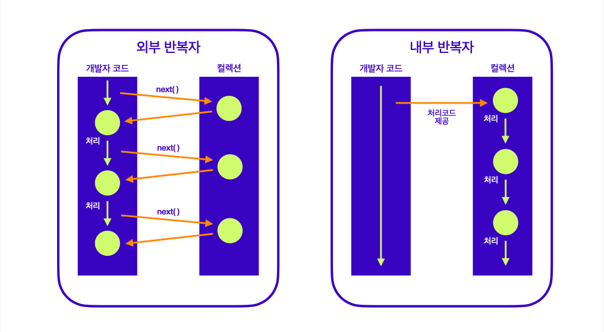
외부 반복자일 경우는 컬렉션의 요소를 외부로 가져오는 코드와 처리하는 코드를 모두 개발자 코드가 가지고 있어야 한다.
반면 내부 반복자는 개발자 코드에서 제공한 데이터 처리 코드(람다식)를 가지고 컬렉션 내부에서 요소를 반복처리한다.
내부 반복자는 멀티 코어  CPU 를 최대한 활용하기 위해 요소들을 분배시켜 병렬 작업을 할 수 있다.
하나씩 처리하는 순차적 외부 반복자보다는 효윻적으로 요소를 반복시킬 수 있는 장점이 있다.
<br>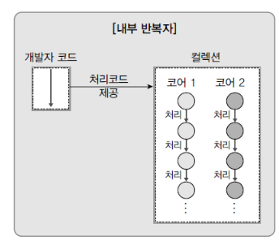<br>
ParallellStreamExample은 List 컬렉션의 내부 반복자를 이용해서 병렬 처리하는 방법을 알려주고 
parallelStream()메소드로 병렬 처리 스트림을 덩고 forEach() 메소드를 호출할 때 요소 처리 방법인
람다식을 제공한다. 람다식은 처리되는 요소가 무엇이고 어떤 스레드가 처리하는지 출력한다.


## 중간 처리와 최종 처리
스트림은 하나 이상 연결될 수 있다. 다음 그림을 보면 컬렉션의 오리지널 스트림 뒤에 필터링 중간 스트림이 연결될 수 있고  그  뒤에 매핑 중간 스트림이 연결될 수 있다.
이와 같이 스트림이 연결되어 있는 것을 스트림 파이프라인이라고 한다.<br>
<br><br>
오리지널 스트림과 집계 처리 사이의 중간 스트림은 최종 청리를 위해 요소를 걸러내거나(필터링), 요소를 변환하거나(매핑), 정렬 하는 작업을 한다.
최종 처리는 중간 처리에서 정제된 요소들을 반복하거낭 집계(카운팅, 총합, 평균) 작업을 수행한다.
다음은 Student 객체를 요소로 가지는 컬렉션에서 Student 스트림을 얻고 중간처리를 통해 score 스트림을 변환한 후 최종 집계로 score 평균을 구하는 과정을 나타낸 것이다.
```Java
//Stream
Stream<Student> studentStream = list.stream();
//stream
IntStream scoreStream = studentStream.mapToInt(student -> student.getScore());
//평균 계산
double avg = scoreStream.average().getAsDouble();
```
mapToInt() 메소드는 객체를 int값으로 매핑해서 IntStream으로 변환시킨다. 어떤 객체를 어떤 int 값으로 매핑할 것인지는 람다식으로 제공해야 한다.
student -> student.getScore()는 Student 객체를 getScore()의 리턴값으로 매핑한다. IntStream은 최종 처리를 위해 다양한 메소드를 제공하는데 , average() 메소드는 요소들의 평균값을 계산한다.
메소드 체이닝 패턴을 이용하면 더 간결하게 작성할 수 있다.
```markdown
double avg = list.stream()
    .mapToInt(student -> student.getScore())
    .average();
    .getAsDouble();
```
스트림 파이프라인으로 구성할때 주의점은 파이프라인의 맨 끝에는 반드시 최종 처리 부분이 있어야 한다는 것이다.
최종 처리가 없다면 오리지널 및 중간 처리 스트림은 동작하지 않는다. 즉, 위 코드에서 average() 이하를 생략하면 stream(), mapToInt()는 동작하지 않는다.


# 리소스로부터 스트림 얻기
java.until.stream  패키지에 스트림 인터페이스들이 있다. BaseStream을 부모로 한 자식 인터페이스들은 다음과 같은 상속 관계를 이룬다.
 <br>
BaseStream에는 모든 스트림에서 사용할 수 있는 공통 메소드들이 정의되어 있다.
Stream은 객체 요소를 처리하는 스트림이다. IntStream, Long Stream, DoubleStream 은 각각 기본 타입인 int, long ,double 요소를 처리하는 스트림이다.
이 스트림 인터페이스들의 구현 객체는 다양한 리소스로부터 얻을 수 있다. 
주로 컬렉션과 배열에서 얻지만 다음과  같은 리소스로부터 스트림 구현 객체를 얻을 수 있다.
<table>
<tr><td>리턴 타입</td> <td> 메소드(매개변수) </td> <td> 소스</td></tr>
<tr><td>Stream(T)</td> <td> java.util.Collection.stream() / java.util.Collection.parallelStream() </td> <td> List컬렉션 / Set컬렉션 </td></tr>
<tr><td>Stream(T) / IntStream / LongStream / DoubleStream </td> <td> Arrays.stream(T[]) , Stream.of(T[]) / Arrays.stream(int[]) , IntStream.of(int[]) / Arrays.stream(long[]) , LongStream.of(long[]) / Arrays.stream(double[]), DoubleStream.of(double[]) </td> <td> 배열</td></tr>
<tr><td>IntStream</td> <td> IntStream.range(int, int) / IntStream.rangeClosed(int, int) </td> <td>int 범위</td></tr>
<tr><td>LongStream</td> <td> LongStream.range(long, long) / LongStream.rangeClosed(long, long) </td> <td>long 범위</td></tr>
<tr><td>Stream(Path)</td> <td> File.list(Path) </td> <td>디렉토리</td></tr>
<tr><td>Stream(String)</td> <td> Files.lines(Path, Charset) </td> <td> 텍스트 파일</td></tr>
<tr><td>DoubleStream / IntStream / LongStream </td> <td> Random.doubles(....) / Random.ints() / Random.longs() </td> <td> 랜덤수</td></tr>
</table>

## 컬렉션으로부터 스트림 얻기
java.util.Collection  인터페이스는 스트림과 parallelStream() 메소드를 가지고 있기 때문에 자식 인터페이스인 List, Set 인터페이스를 구현한 모든 컬렉션에서 객체 스트림을 얻을 수 있다.
다음 Product 로 이어지는 예제는 List<Product> 컬렉션에서 Product 스트림을 얻는 방법을 보여준다.


## 배열로부터 스트림 얻기
java.util.Arrays 클래스를 이용하면 다양한 종류의 배열로부터 스트림을 얻을 수 있다. 
ArrayStreamExample 클래스를 보면 된다.

## 숫자 범위로부터 스트림 얻기
IntStream, LongStream 의 정적메소드이니 range()와 rangeClosed() 메소드를 이용하면 특정 범위의 정수 스트림을 얻을 수 있다. 첫번째 매개값은 시작 수이고 두번째 매개값은 끝수인데, 끝수를 포함하지 않으면, range(), 포함하면 rangeClosed() 를 사용한다.
IntStreamExample 클래스를 보면 된다.

## 파일로부터 스트림 얻기
java.nio.file.Files의 lines()메소드를 이용하면 텍스트 파일의 행단위 스트림을 얻을 수 있다. 이는 텍스트 파일에서 한 행씩 읽고 처리할때 우용하게 사용할 수 있따.
data.txt 파일과 FileStream 클래스 예제를 보면 된다.


# 요소 걸러내기 (필터링)
필터링은 요소를 걸러내는 중간처리 기능이다. 필터링 매소드에는  distinct()와 filter()가 있다.
<table>
<tr><td>리턴타입</td><td>메소드(매개변수)</td><td>설명</td></tr>
<tr><td>Stream / IntStream / LongStream / DoubleStream<td>distinct()</td><td>중복 제거</td></tr>
<tr><td>Stream / IntStream / LongStream / DoubleStream<td>filter(Predicate(T)) / filter(IntPredicate) / filter(LongPredicate) / filter(DoublePredicate) </td><td>조건 필터링, 매개 타입은 요소 타입에 따른 함수형 인터페이스이므로 람다식으로 작성 가능</td></tr>
</table>
distinct() 메소드는 요소의 중복을 제거한다.
객체 스트림일 경우, equals() 메소드의 리턴값이 true면 동일한 요소로 판단한다.
IntStream, LongStream, DoubleStream은 같은 값일 경우 중복을 제거한다.


filter()매소드는 매개값으로 주어진 Predicate 가 true 를 리턴하는 요소만 필터링 한다.


Predicate 는 함수형 인터페이스로 다음과 같은 종류가 있다.
<table>
<tr><td>인터페이스</td><td>추상 메소드</td><td>설명</td></tr>
<tr><td>Predicate(T)</td><td>boolean test(T t)</td><td>객체T를 조사</td></tr>
<tr><td>IntPredicate</td><td>boolean test(int value)</td><td>int 값을 조사</td></tr>
<tr><td>LongPredicate</td><td>boolean test(long value)</td><td>long 값을 조사</td></tr>
<tr><td>DoublePredicate</td><td>boolean test(double value)</td><td>double값을 조사</td></tr>
</table>


모든 Predicate는 매개값을 조사한 후 boolean을 리턴하는 test() 메소드를 가지고 있다.
Predicate<T>을 람다식으로 표현하면 다음과 같다.
```Java
T -> { ... return true}
또는
T -> true; // return 문만 있을 경우 중괄호와  return 키워드 생략 가능
```

# 요소 변환(매핑)
매핑(mapping)은 스트림의 요소를 다른 요소로 변환하는 중간 처리 기능이다. 매핑 메소드는 mapXxx(), asDoubleStream(), asLongStream(), boxed(), flatMapXxx() 등이 있다.

## 요소를 다른 요소로 변환
mapXxx() 메소드는 요소를 다른 요소로 변환한 새로운 스트림을 리턴한다.
다음 그림처럼 원래 스트림의 A 요소는 C로 B 요소는 D요소로 변환해서 C,D 요소를 가지는 새로운 스트림이 생성된다.
<br>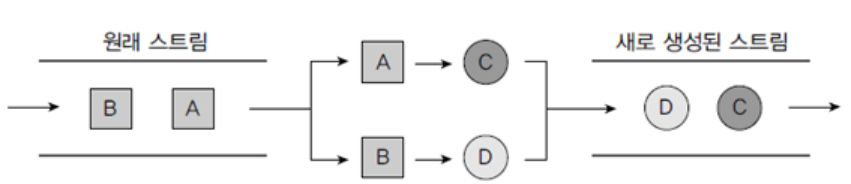
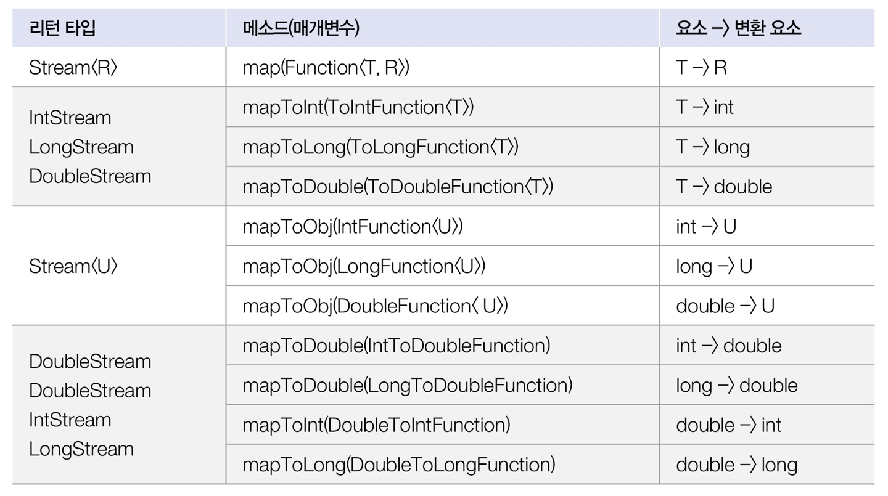
<br><br>
매개타입인 Function은 함수형 인터페이스로 다음과 같은 종류가 있다.
<br><br>
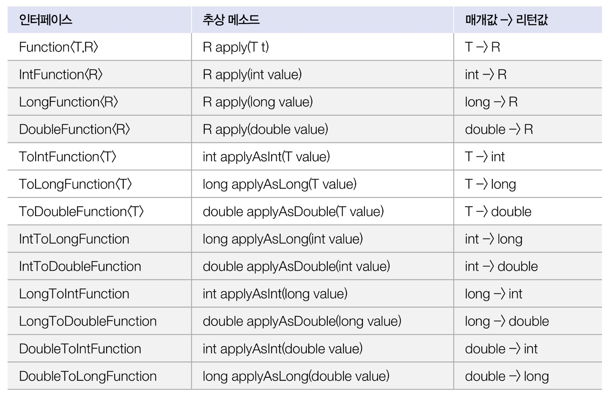
모든 Function은 매개값을 리턴값으로 매핑(변환)하는 applyXxx()메소드를 가지고 있다.<br>
매개값              리턴값
-----> applyXxx() ------>
Function<T,R>을 람다식으로 ㅠㅛ현하면 다음과 같다
```markdown
T -> { ...return R};
또는
T -> R;  // return 문만 있을 경우 중괄호와 return 키워드 생략 가능
```
Student 스트림을 score스트림으로 변환하고 점수를 콘솔에 출력하는 예제, student02 - MapExample 클래스


## 요소를 복수개의 요소로 변환
flatMapXxx() 메소드는 하나의 요소를 복수 개의 요소들로 변환한 새로운 스트림을 리턴한다.
다음 그림처럼 원래 스트림의 A요소를 A1,A2요소로 변환하고 B 요소를 B1, B2로 변환하면 A1, A2, B1, B2요소를 가지는 새로운 스트림이 생성된다.
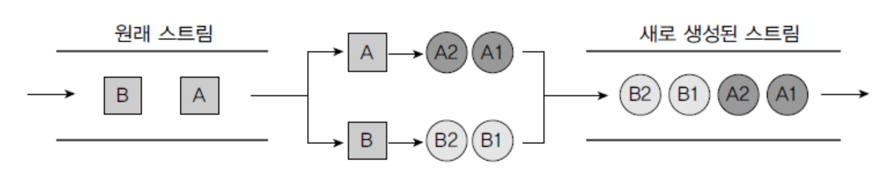

flatMap()메소드의 종류는 다음과 같다.
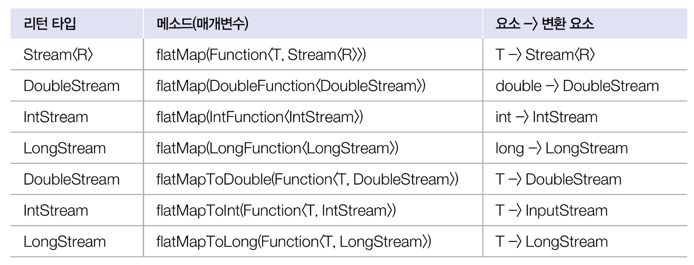
FlatMappingExample은 문장 스트림을 단어 스트림으로 변환하고 문자열 숫자 목록 스트림을 숫자 스트림으로 변환한다.


## 요소의 정렬
정렬은 요소를 내림차순 또는 오름차순으로 정렬하는 중간 처리 기능이다. 요소를 정렬하는 메소드는 다음과 같다.
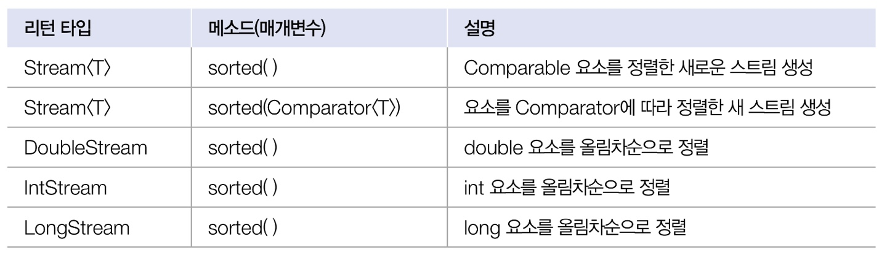

### Comparable 구현 객체의 정렬
스트림의 요소가 객체일 경우 객체가 Comparable을 구현하고 있어야만 sorted()메소드를 사용하여 정렬할 수 있다.
그렇지 않다면 ClassCastException이 발생한다. Comparable을 구현하는 방법은 이전에 배웠다.
```markdown
public XXX implements Comparable {
...}


List<Xxx>list = new ArrayList<>();
Stream<Xxx> stream = list.stream();
Stream<Xxx> orderedStream = stream.sorted();

```
만약 내림차순으로 저열ㄹ하고 싯ㅍ다면 다음과 같이 Comparator.reverseOrder() 메소드가 리턴하는 Comparator 를 매개값으로 제공하몀ㄴ 된다.
```markdown
Stream<Xxx> reverseOrderedStream = stream.sorted(Comparator.reverseOrder());
```
다음은 Student03-SortingExample로   보자

### Comparator 를 이용한 정렬
요소 객체가 Comparable을 구현하고 있지 않다면, 비교자를 제공하면 요소를 정렬시킬 수 있다.
비교자는 Comparable 인터페이스를 구현한 객체를 말하는데 간단하게 람다식으로 설명할  수 있다.
```markdown
sorted((o1, o2) -> { ... })
```
중괄호 안에는 o1이 o2보다 작으면 음수, 같으면 0 , 크면 양수를 리턴하도록 작성하면 된다.
o1과 o2가 정수일 경우에는 Integer.compare(o1, o2)를 실수일 경우에는 Double.compare(o1, o2)를 호출해서 리턴값을 리턴해도 좋다.
student 클래스랑 SortingExample02 예제로 본다.

## 요소를 하나씩 처리(루핑)
루핑은 스트림에서 요소를 하나씩 반복해서 가져와 처리하는 것을 말한다. 루핑 메소드에는 peek()와 forEach()가 있다.
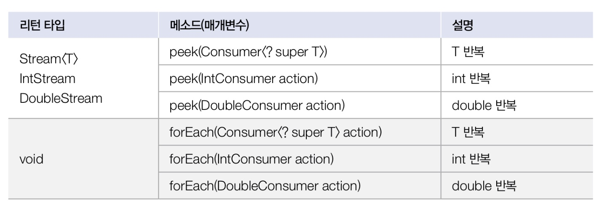
peek()와 forEach()는 동일하게 요소를 루핑하지만 peek()은 중간처리 메소드이고 forEach()는 최종 처리 메소드다.
따라서 peek()는 최종처리가 뒤에 붙지 않으면 동작하지 않는다.
매개타입인 Consumer는 함수형 인터페이스로 모든 Comsumer 는 매개값을 처리하는 accept()메소드를 가지고 있다.
매개값
------> accept
모든 Consumer 는 매개값을 처리하는 accept()메소드를 가지고 있다.

Comsumer<? super T> 를 람다식으로 표현하면 다음과 같다.
```markdown
T -> { ... }
또는
T -> 실행문; //하나의 실행문만 있을 경우 중괄호 생략
```

## 요소 조건 만족 여부(매칭)
매칭은 요소들이 특정 조건에 만족하는지 여부를 조사하는 최종 처리 기능이다. 매칭과 관련된 메소드는 다음과 같다.
최소한 하나의 요소가 만족하는지 (anyMatch())
모든 요소가 만족하는지 (allMatch())
모든 요소가 만족하지 않는지(noneMatch()))

이 매소드들은 매개값으로 주어진 Predicate가 리턴하는 값에 따라 true, false를 리턴한다. 
예를 들어 allMatch()는 모든 요소의 Predicate가 true를 리턴해야만 true를 리턴한다.


## 요소 기본 집계
집계는 최종 처리 기능으로 요소들을 처리해서 카운팅, 합계, 평균값, 최대값, 최소값 등과 같이 하나의 값으로 산출하는 것을 말한다.
즉, 대량의 데이터를 가공해서 하나의 값으로 축소하는 리덕션이고 볼 수 있다.


집계 메소드가 리턴하는 OptionalXXX는 Optional, OptionalDouble, OptionalInt, OptionalLong 클래스를 말한다.
이들은 최종값을 저장하는 객체로 get(), getAsDouble(), getAsInt(), getAsLong()을 호출하면 최종값을 얻을 수 있다.

### Optional 클래스
Optional, OptionalDouble, OptionalInt, OptionalLong 클래스는 단순히 집계값만 저장하는 것이 아니라, 집계값이 존재하지 않을 경우 디폴트 값을 설절하거나 집계값을 처리하는  Consumer 를 등록할 수 있다.
다음은 Optional 클래스가 제공하는 메소드다.
boolean isPresent() : 집계값이 있는지 여부
T, double, int, long orElse() : 집계값이 없을 경우 디폴트 값 설정
void ifPresent() : 집계값이 있을 경우 Consumer 에서 처리

컬렉션의 요소는 동적으로 추가되는 경우가 많다. 만약 컬렉션에 요소가 존재하지 않은면 집계값을 산출할 수 없으므로 NoSuchElementException 예외가 발생한다.
하지만 앞의 예시들 중 메소드를 쓰면 예외를 막을 수 있다.
예를 들어 평균을 구하는  average 를 최종 처리에서 사용할 경우 3가지 방법으로 요소가 없는경우를 대비할 수 있다.
1) isPresent()메소드가 true를 리턴할 떄만 집계값을 얻는다.\
```Java
OptionalDouble optional = stream.average();
if(optional.isPresent()) {
    System.out.println("평균 : " +optional.getAsDouble());
)else{
    System.out.prinltn("평균 : 0.0");
```
2) orElse() 메소드로 집계값이 없을 경우를 대비해서 디폴트값을 정해놓는다.
```Java
double avg = stream.averge().orElse(0.0);
System.out.println("평균 :"+avg);
```
3) ifPresent() 메소드로 집계값이 있을 경우에만 동작하는 Consumer람다식을 제공한다.
```Java
stream.average().ifPresent(a -> System.out.println("평귶": a));
```


## 요소 커스텀 집계
 다양한 집계 결과물을 만들 수 있도록 reduce()메소드로 제공한다.
 
매개값이 BinaryOperator는 함수형 인터페이스다. BinaryOperator 는 두개의 매개값을 받아 하나의 값을 리턴하는 apply()메소드를 가지고 있기 때문에 람다식을 다음과 같이 작성할 수 있다.
```markdown
(a,b) -> { .. return 값};
또는
(a,b) -> 값 // return 문만 있을 경우 중괄호와 return 키워드 생략 가능

```


## 요소 수집
스트림은 요소들을 필터링 또는 매핑한 후 요소들을 수집하는 최종 처리 메소드인 collect()를 제공한다.
이 메소드를 이용하면 필요한 요소만 컬렉션에 담을 수 있고 요소들을 그룹핑한 후에 집계도 할 수 있다.


### 필터링한 요소 수집
Stream의 collect(Collector<T,A,R> collector)메소드는 필터링, 매핑된 요소들을 새로운 컬렉션에 수집하고 이 컬렉션을 리턴한다.
매개값인 Collector 는 어떤 요소를 어떤 컬렉션에 수집할 것인지 결정한다.
타입 파라미터의 T는 요소 , A는 누적기, R은 요소가 저장된 컬렉션이다. 풀어서 해석하면 T요소를 A누적기가 R에 저장한다는 의미이다.
Collector의 구현 객체는 다음과 같이 Collector클래스의 정적 메소드로 얻을 수 있다.

<table>
<tr><td>리턴 타입</td><td> 메소드 </td> <td>설명</td></tr>
<tr><td>Collector(T, ? , List(T)) </td><td> toList() </td> <td>T를 List에 저장</td></tr>
<tr><td>Collector(R, ? , Set(T)) </td>td> toSet() </td> <td>T를 Set에 저장</td></tr>
<tr><td>Collector(T, ?, Map(K, U)) </td><td> toMap(Function(T, K) keyMapper, Function(T, U) valueMapper</td> <td>T를 K와 U로 매핑하여 K를 키로 U를 값으로 Map에 저장</td></tr>
</table>

리턴값인 Collector를 보면 A(누적기)가 ?로 되어있는데 이것은 Collector가 List,Set, Map컬렉션에 요소를 저장하는 방법을 알고 있어 별도의 누적기가 필요없기 때문이다.

```Java
import stream.Student;

List<Student> maleList = totalList.stream().filter(s -> s.getSex().equals("남")).collect(Collector.toList());
```

다음은 Student 스트림에서 이름을 키로 점수를 값으로 갖는 Map컬렉션을 생성하는 코드

```Java
import java.util.stream.Collectors;

Map<String, Integer> map = totalList.stream().collect(Collectors.toMap(s -> s.getName(), s-> s.getScore()));
```

Java16부터는 좀더 편리하게 요소 스트림에서 List 컬렉션을 얻을 수 있다. 스트림에서 바로 toList()메소드를 다음과 같이 사용하면 된다.
```java
List<Student> maleList = totalList.stream().filter(s -> s.getSex().equalS("남")).toList();
```

## 요소 그룹핑
collect() 메소드는 단순히 요소를 수집하는 기능 이외에 컬렉션의 요소들을 그룹핑해서 MAp 객체를 생성하는 기능도 제공한다.
Collectors.groupingBy() 메소드 얻은 Collector를 collect() 메소드를 호출할 때 제공하면 된다.
<table>
<tr><td>리턴 타입 </td><td>메소드</td></tr>
<tr><td>Colletor(T, ?, Map(K, List(T))) </td><td> groupingBy(Function(T, K)classifier)</td></tr>
</table>

groupingBy()는 Function을 이용해서 T를 K 로 매핑하고 K를 키로 해 List<T>를 값으로 갖는 Map 컬렉션을 생성한다.
예시는 "남", "어" 를 키로 설정하고 List<Student>를 값으로 갖는 Map을 생성하는 코드다.

 ```java
 import java.util.stream.Collectors;

Map<String, List<Student>> map = totalList.stream().collect(Collectors.groupingBy(s -> s.getSex()));

```


Collector.groupingBy()메소드는 그룹핑 후 매핑 및 집계를 수행할 수 있도록 두번째 매개값이 Collector를 가질 수 있다.
다음은 두번째 매개값으로 사용될 Collector를 얻을 수 있는 Collectors의 정적 메소들이다. <br>
Collector.mapping(Function, Collector) : 매핑 <br>
Collector.averagingDouble(ToDoubleFunction) : 평균값 <br>
Collector.counting() : 요소수 <br>
Collector.maxBy(Comparator) : 최대값 <br>
Collector.minBy(Comparator) : 최소값 <br>
Collector.reducing(BinaryOperator<T>) <br>
Collector.reducing(T identity,BinaryOperator<T>) : 커스텀 집계 값 <br>

 ## 요소 병렬 처리  Parallel Operation
 멀티 코어  CPU  환경에서 전체 요소를 분할해서 각각의 코어가 병렬적으로 처리하는 것을 말하낟. 요소 병렬 처리의 목적은 작업 처리 시간을 줄이는 것에 있다.
자바는 요소 병렬 처리를 위해 병렬 스트림을 제공한다.


### 동시성과 병렬성  Concurrency , Parallelism
 멀티스레드는 동시성 또는 병렬성으로 실행되기 때문에 이들 용어에 대해 정확히 이해하는 것이 좋다.
동시성은 멀티 작업을 위해 멀티 스레드가 하나의 코어에서 번갈아 가면 실행하는 것을 말하고 병렬성은 멀티 작업을 위해 멀티 코어를 각각 이용해서 병렬로 실행하는 것을 말한다.
<br>
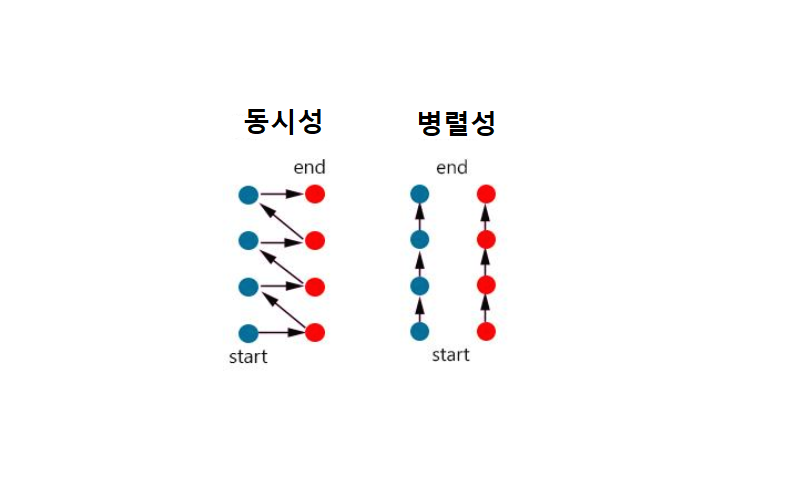
 
동시성은 한 시점에 하나의 작업만 실행한다. 번갈아 작업을 실행하는 것이 워낙 빠르다보니 동시에 처리되는 것처럼 보일 뿐이다.<br>
병렬성은 한 시점에 여러 개의 작업을 병렬로 실행하기 때문에 동시성보다는 좋은 성능을 낸다.<br>
병렬성은 데이터 병렬성과 작업 병렬성으로 구분할 수 있다.

#### Data Parallelism (데이터 병렬성)
전체 데이터를 분할해서 서브 데이터셋으로 만들고 이 서브 데이터셋들을 병렬 처리해서 작업을 빨리 끝내는 것을 말한다.
자바 병렬 스트림은 데이터 병렬성을 구현한 것이다.

#### Task Parallelism (작업 병렬성)
작업 병렬성은 서로 다른 작업을 병렬 처리하는 것을 말한다. 작업 병렬성의 대표적인 예로는 서버 프로그램이다.
서버는 각각의 클라이언트에서 요청한 내용을 개별 스레드에서 병렬로 처리한다.


### 포크조인 프레임워크
자바 병렬 스트림은 요소들을 병렬 처리하기 위해 포크조인 프레임워크를 사용한다.
포크조인 프레임 워크는 포크단계에서 전체 요소들을 서브 요소셋으로 분할하고 각각의 서브 요소셋을 멀티 코어에서 병렬로 처리한다.
조인 단꼥렝서는 서브 결과를 결합해서 최종 결과를 만들어낸다.

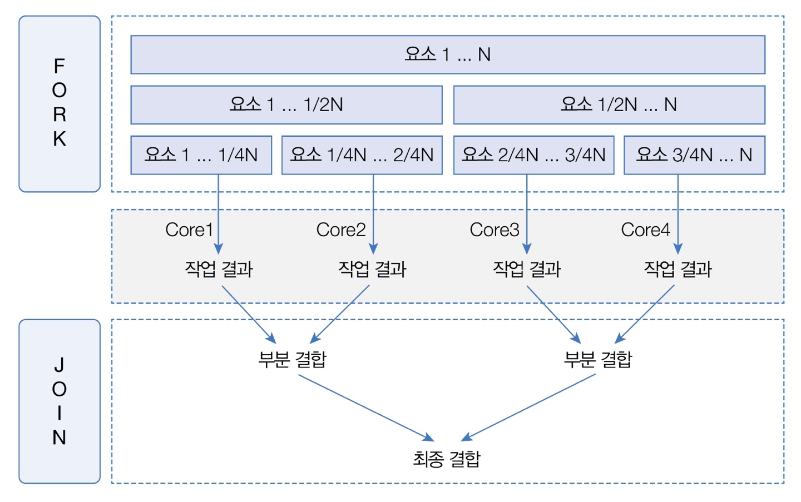
예를 들어 코드 CPUI에서 병렬 스트림으로 요소들을 처리할 셩우 먼저 포크 단계에서 스트림의 전체 요소들을 4개의 서브 요소셋으로 분할한다.
그리고 각각의 서브 요소셋을 개별 코어에서 처리하고 조인 단계에서는 3번의 결합 과정을 거쳐 최종 결과를 산출한다.
병렬 처리 스트림은 포크 단계에서 요소를 순서대로 분할하지 않는다. 이해하기 쉽도록 위 그릠에서는 앞에서부터 차례댛로 4등분했지만 내부적으로 요소들을 나누는 알고리즘이 있기 때문에 개발자는 신경 쓸 필요가 없다.<br>
포크 조인 프레임워크는 병렬 처리를 위해 스레드풀을 사용한다. 각각의 코어에서 서브 요소셋을 처리하는 것은 작업 스레드가 해야 하므로 스레드 관리가 필요하다.
포크 조인 프레임워크는 ExecutorService 구현 객체인 ForkJoin Pool을 사용해서 작업 스레드를 관리한다.
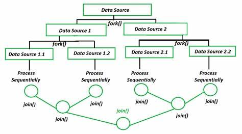

### 병렬 스트림 사용
자바 병렬 스트림을 이용할 경우에는 백그라운드에서 포크조인 프레임워크가 사용되기 때문에 개발자는 매우 쉽게 병렬 처릴를 할 수 있다.
병렬 스트림은 다음 두가지 메소드로 얻을 수 있다.<br>
Stream.parallelStream() : List, Set 컬렉션 <br>
Stream, IntStream, LongStream, DoubleStream.parallel(): java.util.Stream, java.util.IntStream, java.util.LongStream, java.util.DoubleStream
<br>
parallelStream() 메소드는 컬렉션(List, Set)으로부터 병렬 스트림을 바로 리턴한다. parallel()메소드는 기존 스트림을 병렬 처리 스트림으로 변환한다.
<br>
### 병렬 처리 성능
스트림 병렬 처리가 스트림 순차 처리보다 항상 실행 성능이 좋다는건 아니다. 그전에 먼저 병렬 처리에 영향을 미치는 3가지 요인을 봐야한다.
1) 요소의 수와 요소당 처리 시간
컬렉션에 전체 요소의 수가 적고 요소당 처리 시간이 짧으면 일반 스트림이 병렬 스트림보다 빠를 수 있다. 병렬 처리는 포크 및 조인 단계가 있고 스레드 풀을 생성하는 추가적인 비용이 발생하기  때문이다.
2) 스트림 소스의 종류
ArrayList와 배열은 인덱스로 요소를 관리하기 때문에 포크 단계에서 요소를 쉽게 분리할 수 있어 병렬 처리 시간이 절약된다. 반면에 HashSet, TreeSet은 요소 분리가 쉽지 않고 LinkedList 역시 링크를 따라가야 하므로 요소 분리가 쉽지 않다 따라서 이 소스들은 상대적으로 병렬 처리가 늦다.
3) 코어의 수 (Core)
CPU 코어의 수가 많으면 많을수록 병렬 스트림의 성능은 좋아진다. 하지만 코어 수가 적을 경우에는 일반 스트림이 더 빠를 수 있다. 병렬 스트림은 스레드 수가 증가하여 동시성이 많이 일어나므로 오히려 느려진다.
