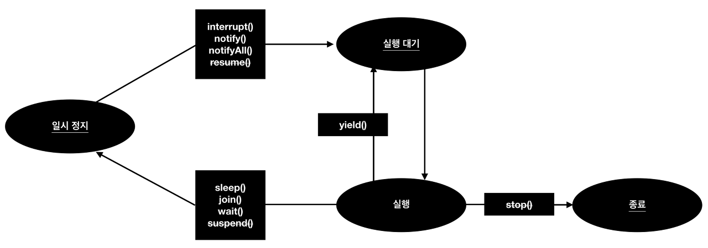
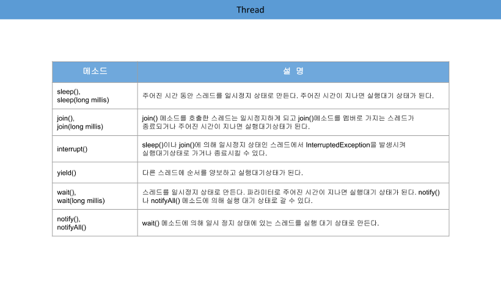

### 스레드의 이름

작업 스레드는 자동적으로 Thread-n이라는 이름을 가진다.
다른 이름으로 설정하고 싶다면 setName()메서드를 이용한다.
```java
thread.setName("스레드 이름");
```
스레드 이름은 디버깅 시 어떤 스레드가 작업하는지 조사할 목적으로 사용된다.
현재 코드를 어떤 스레드가 실행하고 있는지 호가인하려면 정적메서드인 currentThread()로 스레드 객체의 참조를 얻은 다음 
getName()메서드로 이름을 출력해보면 된다.

```java
Thread thread  = Thread.currentThread();
System.out.println(thread.getName());
```
<br>

### 스레드의 상태

스레드 객체를 생성하고 start()메서드를 호출하면 곧바로 스레드가 실행되는 것이 아니라, 실행 대기 상태로 된다.
실행 대기 상태란, 실행을 기다리고  있는 상태를 말한다.

실행대기하는 스레드는 CPU 스케줄링에 따라 CPU 를 점유하고 run()메서드를 실행한다.
이때를 실행 상태라고 한다. 다른 스레드가 실행 상태가 된다.

이렇게 스레드는 실행대기 상태와 실행상태를 번갈아 가면서 자신의 run()메서드를 조금씩 실행한다.
실행 상태에서 run()메서드가 종료되면 더 이상 실행할 코드가 없기 때문에 스레드의 실행은 멈추게 된돠. 이 상태를 종료 상태라고 한다.

실행 상태에서 일시 정지 상태로 가기도 하는데, 일시 정지 상태는 스레드가 실행할 수 없는 상태를 말한다. 스레드가 다시 실행 상태로 가기 위해서는 
일시 정지 상태에서 실행 대기 상태로 가야만 한다.


표에서 wait(), notify(), notifyAll()은 Object클래스의 메서드고 그외는 Thread 클래스의 메서드다.
wait(), notify(), notifyAll(), 메서드의 사용방법은 스레드 동기화에서 알아보기로 하고 , 여기서는 Threrad 클래스의 메서드만 살펴본다.